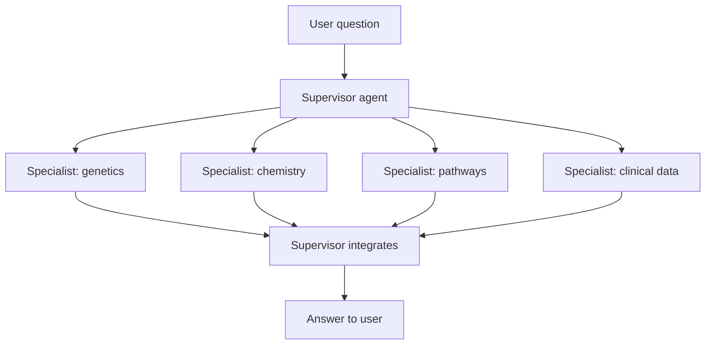
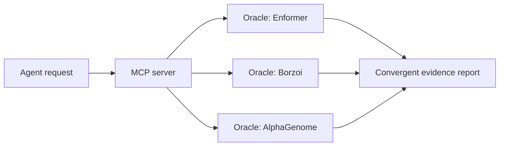
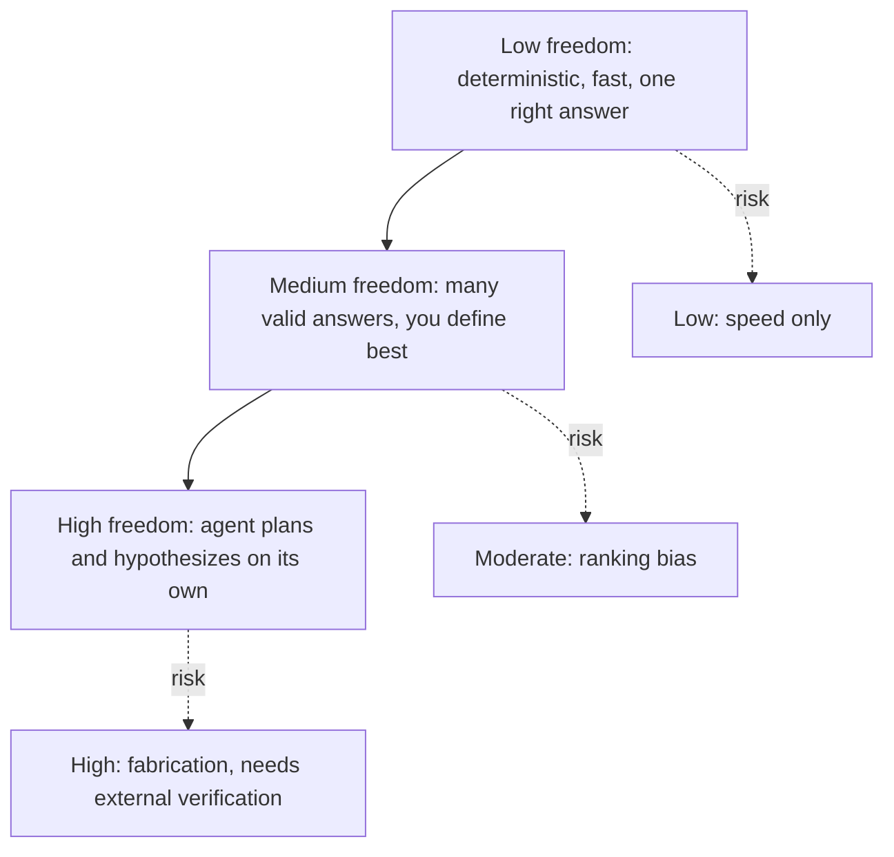

# Chapter 1: Multi-agent orchestration, architectures for teams of specialist agents

## Contents
- [What is it?](#what-is-it)
- [Why does it exist?](#why-does-it-exist)
- [How does it work?](#how-does-it-work)
- [What this means for you](#what-this-means-for-you)
- [Sources](#sources)

## What is it?

A multi-agent system splits one big biomedical question into smaller sub-questions and hands each one to a specialist AI agent with its own tools, its own data, and its own narrow job. A supervisor agent decomposes the question, routes the pieces, and reassembles the specialists' answers into one response. Nobody, human or model, tries to hold the whole problem in one head.

Think of it like a hospital. You do not walk in and describe your symptoms to one doctor who is also the radiologist, the pharmacist, and the lab technician. A triage nurse (the supervisor) routes you to a cardiologist for your heart, a separate lab for your bloodwork, and a pharmacist for your prescription. Each specialist knows their domain deeply and has the tools for it. The triage nurse's job is routing and integration, not medicine.

## Why does it exist?

Biomedical discovery evidence is scattered across incompatible domains. Drug discovery evidence alone spans statistical genetics, functional genomics, chemistry, pathway biology, and clinical trial data. No single model, and no single person, holds all of that competently. Three talks from ISMB 2026 built systems around this fact directly.

The Virtual Biotech (Harrison Zhang, MLCSB) organized a team of agents the way a real drug discovery company organizes people: a Chief Scientific Officer (CSO) agent that receives a scientific query, splits it into sub-questions, and delegates each to a domain-specialized scientist agent covering statistical genetics, functional genomics, pathways and interactions, cheminformatics, disease biology, and clinical data. LungChat (Pankaj Rajdeo, MLCSB) did the same for multi-omics: a supervisor agent breaks a plain-English question into parallel sub-tasks for four specialists, Single-Cell, Spatial Omics, Research, and Atlas, each grounded in a curated library of bioinformatics tools. Chorus (Luca Pinello, Monday) solved a narrower version of the same problem: dozens of DNA-to-function prediction models exist, each with different dependencies, input sizes, and output formats, and comparing them by hand takes heroic engineering. Chorus wraps each one behind a single interface so an agent can call any of them the same way.

The deeper reason this pattern exists: a single agent asked to do everything either specializes badly, because it is a generalist stretched thin, or specializes well but slowly, because it must load a huge, mixed context for every step. Splitting by domain fixes both. Each specialist's context stays small and relevant. The supervisor's context stays small too, because it only sees sub-task results, not raw data.

## How does it work?

### The supervisor-specialist pattern

Both the Virtual Biotech and LungChat follow the same shape: one orchestrator that decomposes and integrates, several specialists that retrieve and reason within a bounded domain.

The Virtual Biotech's CSO agent ran this at real scale in one demo: more than 37,000 clinical-trialist agents curated outcomes from 55,984 clinical trials. The finding that came out the other end was concrete and checkable: drugs targeting cell-type-specific genes were 40 percent more likely to advance from Phase I to Phase II trials, 48 percent more likely to reach market, and had 32 percent lower adverse-event rates. A human scientist stayed in the loop throughout, reviewing the CSO's synthesis rather than approving each of the 37,000 sub-agent runs individually.

LungChat measured what the supervisor layer actually bought, instead of just building it and asserting it worked. Across 1,080 ablation tests, meaning the hierarchical design was tested against a flat, single-agent version doing the same job, the supervisor-plus-specialist structure cut token use by roughly half and improved refusal of out-of-scope questions by 35 percentage points. Applied to idiopathic pulmonary fibrosis, LungChat's specialists recovered known disease markers and ranked a drug called Saracatinib as the top repurposing candidate, matching an independent clinical trial's choice. Each of LungChat's four specialists draws from a curated library of 51 bioinformatics tools, selected by combining meaning-based search with exact keyword matching so the right tool gets picked even when the query does not use the tool's exact name.

The 35-point refusal improvement is the number worth sitting with. A flat agent, asked something outside its competence, tends to answer anyway because nothing in its architecture forces it to notice the boundary. A supervisor that routes work to bounded specialists has a natural place to say "none of my specialists cover this" and refuse instead of guessing.

### Wrapping specialist tools behind one interface

Chorus solves a different half of the same problem: not "which specialist should answer this," but "how does an agent call a specialist tool without needing to understand that tool's internals." Sequence-to-function models like Enformer, Borzoi, and AlphaGenome each predict what a stretch of DNA does, but they live in different software worlds with different input sizes and dependencies.

Chorus treats each model as an oracle: something that takes genomic coordinates and returns a prediction, with the mess hidden behind one Python interface. Each oracle runs in its own isolated environment, which is both a dependency fix and a security posture, since a broken or compromised model cannot reach outside its own sandbox. Chorus then exposes all seven oracles as a Model Context Protocol (MCP) server, a standard way to hand tools to an AI agent, so a plain-language request like "score this variant across three oracles in liver cell types" lets the agent pick the right oracles, match cell-type tracks, and synthesize a report showing where the oracles agree.

### The freedom axis: how much should an agent decide on its own

Kuan-lin Huang's talk gave the design lens that ties the other two together. The question is not "should this be an agent," it is "how much freedom should this agent have," because more freedom buys flexibility and also buys entropy, meaning more randomness and less control.

Huang lays out three tiers, each with a working example from his own group. Low freedom covers deterministic workflows where the correct answer is fixed and the only job is speed: his team rebuilt a genomics variant-effect tool and reported it annotating a full clinical whole-genome benchmark of over four million variants in about 86 seconds, a speedup of up to 130 times over the standard tool, with identical results verified on a shared subset. Medium freedom covers tasks with many valid answers, such as drug repurposing, where you let the agent search but you define what "best" means, combining binding, selectivity, and real-world evidence, then re-rank candidates across millions of options. High freedom covers AI co-scientists that plan, gather data, write code, and report findings on their own, which means they can also fabricate findings on their own. Huang tied that tier to an external check: an agent's proposed findings were validated against a large real-world replication signal, backing solid, non-retracted papers at markedly higher odds than retracted ones, at roughly two dollars per target.

The pattern across all three tiers is the same design rule: freedom without a matching verification mechanism is the failure mode. Low freedom gets its verification for free, because the answer is deterministic. Medium freedom needs an explicit definition of "best." High freedom needs an external, cheap, scalable check, which is exactly what the replication-odds test provided.

### The infrastructure stack underneath the pattern

Everything above assumes the agent already has models, tools, data processing, and a deployment path to call on. NVIDIA's BioNeMo talk (Chris Dallago, Tuesday, Tech Track) is the vendor's answer to where that stack comes from: an "AI Scientist Enablement Stack" that bundles domain-specific models, scientific tools, accelerated data processing, and production deployment under one roof, then lets an agentic layer orchestrate a design-test-learn loop on top, propose a design, test it against models or tools, learn from the result, iterate.

The verified numbers are the useful part. In testing with GPT-4, task completion rose from 57.1 percent to 100 percent once the agent had access to BioNeMo's agent-ready tool interfaces, which document each model's purpose, inputs, parameters, outputs, and failure modes so the agent can select and invoke the right tool without guessing. Token efficiency roughly doubled alongside it, about twice as many passing assertions per 1,000 tokens. That is a concrete, load-bearing claim: an agent's tool-calling accuracy tracks how well the tool interface documents itself, not just how capable the underlying model is.

This is the commercial, closed-stack version of the same design-test-learn loop the rest of this chapter builds from open pieces. The transferable frame is the loop itself, plus the reminder that agents need a stack (models, tools, data, deployment), not just a prompt. The tradeoff to watch is vendor lock-in: BioNeMo's stack is proprietary infrastructure, where an open, FAIR, provenance-first approach is a real differentiator, not just a philosophical preference.

## What this means for you

Agentic search v4 is, at its core, a supervisor deciding what to retrieve and a set of specialists (retrieval over literature, retrieval over a knowledge graph, tool calls to external databases) doing the retrieving. The three systems in this chapter are working proof that the pattern holds up at scale, not just in a diagram.

Four design decisions to lift directly. First, keep specialists scoped to a domain and a fixed toolset, the way LungChat's four specialists each own 51 tools and the Virtual Biotech's scientist agents each own one discipline. That is least-privilege applied to agent design, and it is the same principle your ai-security-standards rule already requires: an agent inherits the reach of the tools you give it, so scope the reach to exactly the job. Second, measure what the supervisor layer buys with an ablation, the way LungChat did. If you ever build a flat, single-agent version of a v4 feature as a baseline, you get a real number for whether the supervisor layer is worth its complexity, not just an assumption that it is. Third, use Huang's freedom axis explicitly when you design a new v4 capability: is this deterministic retrieval and formatting (low freedom, should be fast and boring), ranking or synthesis with several valid answers (medium freedom, needs an explicit rubric), or open-ended reasoning that could fabricate a connection (high freedom, needs a cheap external verification loop before you trust its output). That axis is also your goal-contracts verify surface, restated for agent autonomy instead of task completion. Fourth, take BioNeMo's tool-documentation finding seriously: the 57 to 100 percent completion jump came entirely from documenting each tool's inputs, outputs, and failure modes for the agent, not from a bigger model. Every tool you expose to v4's specialists earns the same documentation before it earns a call.

The open question worth watching, and one the Virtual Biotech writeup flags but does not fully answer, is how these systems validate the payload passing between the supervisor and each specialist. That is exactly the multi-agent schema gate your own production standards already require: every hop between agents needs a validated, bounded payload, or a malformed result from one specialist can silently corrupt the supervisor's synthesis.

## Sources

| Session | Time | Paper status |
|---------|------|---------------|
| Chorus: an agentic framework for comparative regulatory genomics with sequence-to-function oracles | Monday 15:40-16:00 | Paper verified (via project repository, no standalone preprint yet) |
| The Virtual Biotech: a multi-agent AI framework | Wednesday 11:50-12:00 | Paper verified |
| A conversational multi-agent AI framework for integrated multi-omics | Wednesday 12:00-12:10 | Paper verified |
| How can AI agents help you advance biomedicine? | Wednesday 11:10-11:50 | Paper verified (partial, only the low-freedom example has a standalone preprint) |
| Enabling agentic systems for life science discovery | Tuesday 12:20-13:00 | Paper verified (vendor technical blog, no standalone preprint; foundational BioNeMo framework preprint cited separately) |
