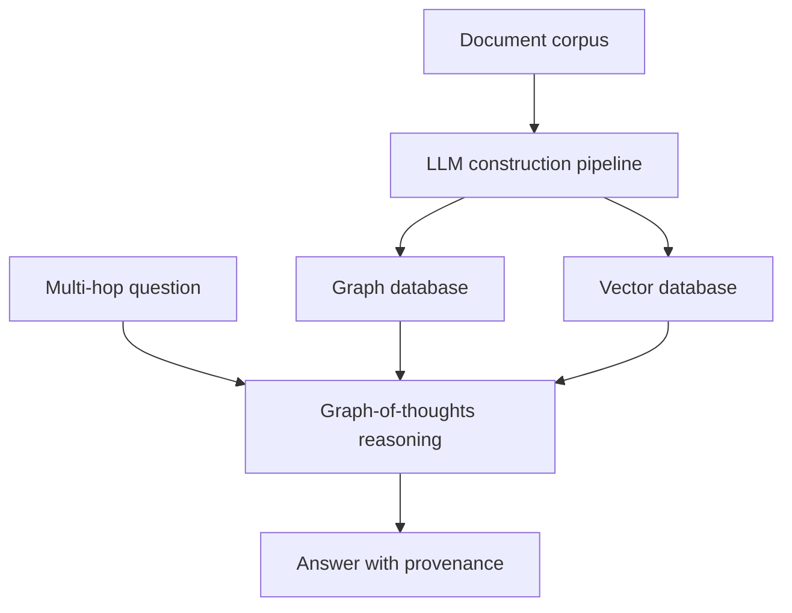
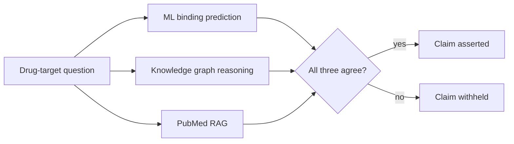
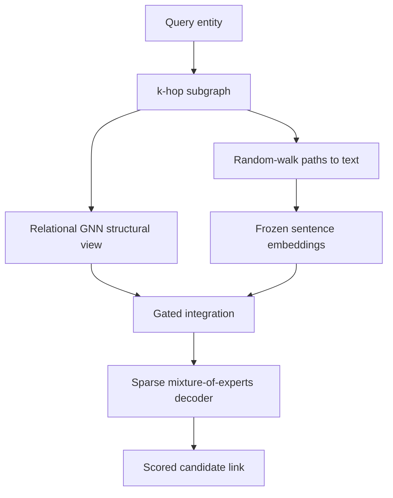

# Chapter 2: Grounding the agent, retrieval, multi-hop reasoning, and evidence triangulation

## Contents
- [What is it?](#what-is-it)
- [Why does it exist?](#why-does-it-exist)
- [How does it work?](#how-does-it-work)
- [What this means for you](#what-this-means-for-you)
- [Sources](#sources)

## What is it?

Grounding is the discipline of tying every claim an agent makes back to a specific piece of evidence, and refusing to make claims that cannot be tied back that way. It is the difference between an agent that answers from what it half-remembers and an agent that answers from what it can point to. Four talks from ISMB 2026 attack different pieces of this problem: how do you know a citation actually supports the sentence it is attached to, how do you chain evidence across many sources to answer a question that needs several linked facts, how do you stop an agent from inventing the connective tissue between real facts, and how do you fuse a knowledge graph's structure with a language model's text understanding without expensive retraining.

## Why does it exist?

A retrieval-augmented system, one that looks things up before answering instead of answering from memory, sounds solved: retrieve a passage, cite it, done. Halil Kilicoglu's talk on reading science at scale punctures that assumption with a number. Researchers manually checked over 3,000 citation instances across 100 highly cited biomedical papers and found close to 39 percent contained accuracy errors, meaning the citation existed but did not actually support the claim it was attached to. Even a strong language model model in a few-shot setting was good at confirming accurate citations but weak at catching errors, missing most of the citation problems that existed. Having a citation is not the same as having a citation that holds up.

That gap gets worse the more hops a question needs. A single-hop question needs one fact from one source. A real biomedical question, "what drug class targets the protein that this disease-causing gene mutation disrupts," needs several linked facts pulled from different places, and each hop is another chance for retrieval to miss or for the model to bridge a gap with an invented connection instead of a retrieved one. eGoT and DrugAgent both exist because multi-hop reasoning is where naive retrieval-augmented generation breaks down, in different ways: eGoT attacks the retrieval side (how do you find and chain the right facts), DrugAgent attacks the reasoning side (how do you stop the model from fabricating the connection between facts it did retrieve). KLaR exists because a knowledge graph alone cannot express everything a passage of text can, and a language model alone cannot enforce a graph's explicit structural rules, so fusing them without expensive fine-tuning is its own open problem.

## How does it work?

### The citation-integrity baseline

Kilicoglu's research program centers on checking whether a citation actually supports its claim, not just whether a citation exists. The reported baseline: a combined retrieval-plus-classification pipeline reached 0.59 micro-F1 on catching citation errors, while a general-purpose language model was strong on confirming correct citations but scored only 0.45 macro-F1 overall, meaning it missed most of the actual errors. This sets the floor any agentic search system should measure itself against: if a purpose-built citation-integrity classifier tops out around 0.59, an agent that merely attaches a citation without checking it is nowhere close to trustworthy.

### eGoT: graph-of-thoughts over two databases

eGoT answers multi-hop questions by building two databases from a document corpus, a graph database that captures entities and relationships explicitly, and a vector database that captures text as embeddings for semantic similarity search, then reasoning over both with a structure called graph-of-thoughts: the reasoning steps themselves form a graph, not a single chain, so partial answers from different hops can merge instead of being forced into one linear path.

The benchmark numbers give this some teeth. On MultiHopRAG, eGoT reached 75.50 percent precision and 79.10 percent accuracy, beating several strong retrieval baselines. On HotpotQA it reached 63.00 percent exact match and 71.11 percent F1, beating two other graph-based retrieval methods outright, though it was roughly tied with a third on exact match rather than winning cleanly, a correction worth noting since the framing in the room suggested a clean sweep. In two biomedical demos, answering expert questions on small cell lung cancer drawn from 1,046 PubMed Central papers, and surfacing a plausible link between lupus and UV exposure, the system's answers stayed traceable to the source papers throughout.

### DrugAgent: triangulation as a hallucination gate

DrugAgent starts from a specific failure mode: an agent that pulls evidence from multiple sources can still invent the reasoning that connects them, producing a mechanistic claim that no single source actually supports. Its fix is structural, not a prompt instruction. Three independent agents each produce evidence about a drug-target interaction: one runs a machine-learning binding-affinity prediction, one runs multi-hop reasoning over a knowledge graph, one runs retrieval-augmented generation over PubMed. A reasoning module only composes a final claim when the three agree, an explicit cross-source consistency rule.

Evaluated on 900 kinase drug-target pairs with an LLM-as-judge protocol, the full three-agent system was faithful to its input evidence in 98.8 percent of cases, with 98 percent label stability across repeated runs of the same question. The talk's own ablation removes one agent at a time and measures precision and recall of the resulting predictions, not a faithfulness breakdown by source count. Removing the knowledge graph agent, for instance, drops precision to 0.187 while recall rises, an ordinary precision and recall trade-off from losing a filtering source. This is worth flagging precisely: the striking claim that two-source agreement produces 15 to 20 percent unfaithful explanations while three-source agreement drops that to near zero does not appear in the paper as stated. What the paper actually supports is the directional finding, that the full triangulated system reaches 98.8 percent faithfulness, which is still strong evidence that requiring independent sources to agree before asserting a claim is a real hallucination defense, just not quantified the way the pre-briefing suggested.

### KLaR: fusing a graph and a frozen language model

KLaR predicts missing links in a biomedical knowledge graph, for example a drug-target or disease-gene association the graph does not yet record, by fusing two views of the same neighborhood without fine-tuning a language model. For a query entity, a relational graph neural network encodes its local k-hop subgraph, capturing explicit structure. Separately, random-walk paths through that same subgraph are turned into sentences using templates, then embedded with an off-the-shelf, frozen sentence-embedding model, no fine-tuning, no external retrieval step. The two views are aligned and fused through a gated integration step, and a sparse mixture-of-experts decoder, which routes different interaction types to different specialized sub-models, scores candidate links.

KLaR was published in Bioinformatics on July 7, 2026, and the mechanism description holds up against the publication. The specific PharmKG, HetioNet, and DTINet benchmark numbers referenced in the pre-briefing could not be independently confirmed, since the secondary source used to verify publication did not carry a results table, so those figures should be treated as unconfirmed rather than false.

## What this means for you

Each of these four talks maps onto a specific gap in agentic search v4's grounding story, and none of them is optional if the goal is a system that earns trust rather than asserts it.

Kilicoglu's number, 39 percent of citations in highly cited papers do not actually support their claims, is the argument for building a citation-integrity check as a distinct step from citation-attachment. Attaching a source is cheap. Verifying the source substantiates the specific sentence it is attached to is the actual grounding gate, and your nws-production-standards rule already names this: a deterministic accept-or-reject check, exact or substring match after normalization, never a fuzzy similarity threshold that can silently pass a near-miss.

eGoT's two-database pattern, a graph database for explicit multi-hop traversal paired with a vector database for semantic retrieval, is close to a working blueprint for v4's own retrieval layer, since neither structure alone handles multi-hop reasoning well. Structuring the reasoning itself as a graph of steps rather than one linear chain is the specific design choice worth studying closely if v4 ever needs to merge partial evidence from different hops into one answer.

DrugAgent's triangulation pattern, requiring independent sources to agree before a claim is asserted, is directly reusable as a design rule even though the specific ablation numbers from the pre-briefing do not hold up under verification. The corrected, verified number, 98.8 percent faithfulness for the full three-source system, is still a strong argument for gating claim assertion on cross-source agreement rather than trusting a single source. This is also a case study in why the research-verification step matters: the striking, quotable number was the wrong one, and the real number, less dramatic but grounded in the actual paper, is the one that should go into any design document.

KLaR's frozen-embedding approach is the cheapest path to graph-plus-text fusion available in this batch of talks: no fine-tuning, no separate retrieval infrastructure, just a template-based textualization of graph paths embedded off the shelf. If v4 ever needs to let a language model reason over graph context without standing up a fine-tuning pipeline, this is the pattern to prototype first, precisely because it is the cheapest one that still worked in a published benchmark.

## Sources

| Session | Time | Paper status |
|---------|------|---------------|
| Reading science at scale: AI for biomedical discovery and trustworthy knowledge | Monday 11:00-11:40 | Paper verified |
| eGoT: enhanced graph-of-thoughts for multi-hop knowledge retrieval and hypothesis generation in biomedicine | Monday 11:40-12:00 | Paper verified |
| DrugAgent: explainable multi-agent reasoning for aggregating heterogeneous biomedical evidence | Monday 12:00-12:20 | Paper verified (with a correction to the headline ablation numbers) |
| KLaR: fusing knowledge graphs and language models for biomedical target discovery | Monday 12:40-13:00 | Paper verified (via secondary aggregator, specific benchmark numbers unconfirmed) |
