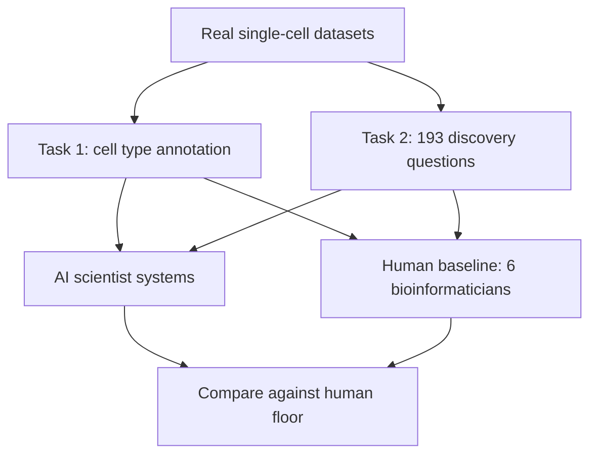
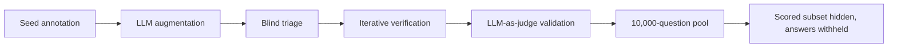
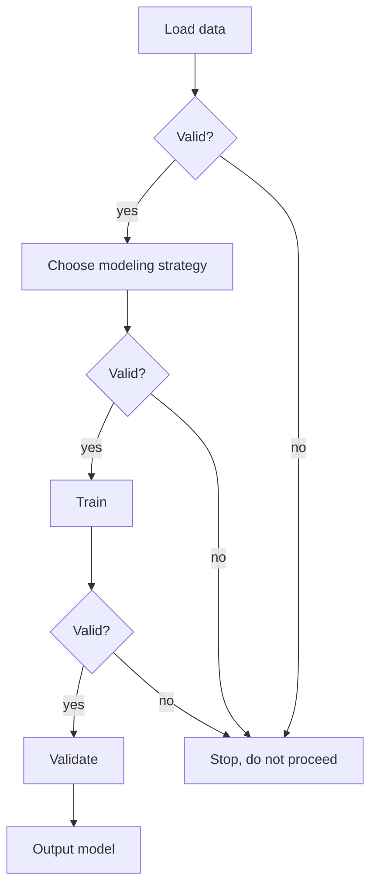
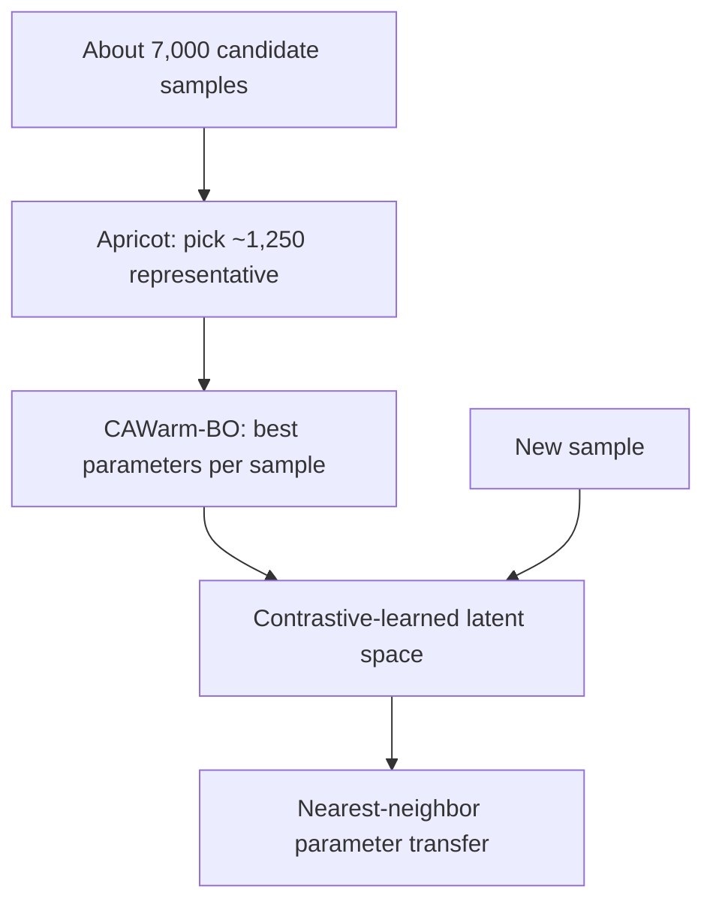

# Chapter 3: Proving it works, benchmarks, checkpoints, and applied evaluation

## Contents
- [What is it?](#what-is-it)
- [Why does it exist?](#why-does-it-exist)
- [How does it work?](#how-does-it-work)
- [What this means for you](#what-this-means-for-you)
- [Sources](#sources)

## What is it?

An agent that sounds confident is not the same as an agent that is right. This chapter covers five talks that each build a different piece of the machinery for telling the two apart: a benchmark that measures whether an "AI scientist" can find a real finding in real data, a benchmark built specifically to resist a model gaming it by having memorized the answer, an agent architecture that refuses to let unverified work compound, a system that tunes a pipeline's parameters and proves the tuning actually helped, and a method that generates useful features from messy metadata using a language model as the tool, not the judge.

## Why does it exist?

Every talk in Chapter 1 made a claim about what its agent could do. None of those claims mean anything without a way to check them. That is the gap this chapter's five talks fill, each from a different angle.

BAISBench and MedHopQA both exist because "the agent gave a plausible-sounding answer" is not evidence, and because two specific failure modes needed a fix. BAISBench's problem: existing tests for AI scientists either test reasoning with no real data attached, or grade a fixed analysis pipeline's output, neither of which resembles the actual job, starting from raw data and finding something true in it. MedHopQA's problem is different and sharper: a multi-hop question-answering benchmark is worthless if the model has already seen the answer during training, so the benchmark itself has to be built to resist contamination, not just to be hard.

Agentomics exists because letting an agent write one long script and hope it works is how errors compound silently, the same failure mode that shows up whenever an agent's output becomes the next agent's input with no check in between. AutoTuneX exists because most bioinformatics tools ship with default parameters nobody tunes, and the ones that get tuned rarely get proof that the tuning helped, just an assertion that it does. The outcome-aware feature generation talk exists because unstructured study metadata, the free-text descriptions attached to a public dataset, is a real source of predictive signal that gets thrown away when every cross-study analysis has to hand-curate its own features from scratch.

## How does it work?

### BAISBench: grading an AI scientist on the actual job

BAISBench sets two tasks on real single-cell transcriptomic data, gene expression measured one cell at a time. Task one is cell type annotation across 15 expert-labeled datasets: the agent has to correctly label what kind of cell each one is. Task two is scientific discovery, 193 multiple-choice questions built directly from the conclusions of 41 published single-cell studies, so the questions test whether the agent can reach the same finding the original researchers reached. Several AI-scientist systems were run through both tasks, and six graduate-level bioinformaticians did the same tasks to set a human baseline.

The result: current AI-scientist systems show substantial potential but fall short of fully autonomous discovery when measured against that human floor. The honest gap between "helps with the task" and "does the task independently" is the finding, not a footnote.

### MedHopQA: building a benchmark that resists memorization

MedHopQA is 1,000 expert-curated, disease-centered, multi-hop question-answer pairs, each one requiring synthesis across at least two source articles rather than a single lookup. The construction pipeline is the interesting part: seed annotation, then augmentation, then blind triage, then iterative verification, then a final LLM-as-judge validation pass, a human-and-model pipeline built specifically to produce hard, verifiably multi-hop questions rather than easy ones dressed up to look hard.

The contamination defense is structural, not procedural: the 1,000 scored questions sit hidden inside a larger 10,000-question pool on a leaderboard with withheld answers, so a model cannot simply have memorized the answer key during training the way it might for a static, fully public benchmark. Gold answers are enriched with synonym sets from MONDO, NCBI Gene, and NCBI Taxonomy so that a correct answer phrased differently still scores as correct, concept-level scoring rather than exact-string scoring.

### Agentomics: checkpoints instead of one long script

Agentomics is an autonomous agent that takes a biomedical dataset and builds a working machine learning model end to end: load data, try modeling strategies, train, validate, output a model. The design choice that makes it reliable is not a smarter model, it is structure. Instead of writing one large script and hoping it works, the agent only builds on top of code that has already passed a validation checkpoint, with a defined interface and a validated artifact required at every stage before the next stage is allowed to start.

Across 20 datasets spanning protein engineering, drug discovery, and regulatory genomics, Agentomics beat other agentic systems, including Biomni, in every domain tested, and matched or beat human-expert-built solutions on 11 of the 20 benchmarks. The checkpoint discipline is what earns that number: an error introduced at the data-loading stage cannot silently propagate into a trained model, because the pipeline will not advance past an unvalidated stage.

### AutoTuneX: proving a tuned parameter actually helped

AutoTuneX automatically picks the best parameter settings for transcript-assembly software, tools like Scallop and StringTie that reconstruct full RNA transcripts from short RNA-seq reads, based on the specific sample being processed, instead of leaving everyone on untouched defaults. The pipeline runs in three steps. First, the apricot algorithm selects roughly 1,250 representative samples out of about 7,000 candidates. Second, a warm-start Bayesian optimization method, CAWarm-BO, finds the best parameter vector for each representative sample, spending its search budget where improvement is likely rather than trying every combination. Third, a contrastive-learning encoder embeds new samples into a latent space where samples that want similar parameters sit near each other, so a brand-new sample gets its parameters by finding its nearest neighbors in that space and transferring their settings.

On the held-out SRA-test set of 1,588 samples, between 81.9 and 99 percent improved over defaults, depending on which assembler was used and how many candidate parameter sets were considered. On the smaller ENCODE65 benchmark, typical AUC gains were in the 2 to 25 percent range. That range matters because the headline "up to 600 percent" figure that circulated is a best-case single-sample outlier, not the typical result, and citing the outlier instead of the range would overstate what the method reliably delivers.

### Outcome-aware feature generation from unstructured metadata

This talk addresses a narrower but common problem: public gene-expression studies come with free-text metadata, sample descriptions, condition labels, experimental notes, that carry real signal but are too unstructured to feed directly into a cross-study statistical model. The approach uses a language model to generate structured, outcome-aware features from that unstructured metadata, so a downstream cross-study transcriptomic analysis can use consistent, comparable features drawn from studies that were never designed to be compared. No public paper or preprint could be located for this specific method as of this writing; the description here is based on the conference abstract only, and any application of the technique should treat the mechanism as reported, not as independently verified against a full methods section.

## What this means for you

This chapter is the evaluation discipline that turns agentic search v4 from a demo into something you can trust, and every talk in it maps onto a concrete piece of the eval-harness rule.

BAISBench is close to a template for what a v4 acceptance test should look like: a frozen, real-data task, graded against a human baseline, not against the model's own confidence. If v4 ever claims a retrieval or synthesis capability, the honest version of that claim needs the same shape, a fixed test set with a known human floor to compare against, not an anecdote about one query that worked.

MedHopQA's contamination-resistance design is the sharper lesson. A benchmark a model may have memorized during training is not measuring capability, it is measuring recall of the test itself. Any evaluation set you build for v4's own multi-hop retrieval needs the same structural defense: hide the scored subset inside a larger pool, withhold answers, and rotate or expand the pool over time so a future model version cannot simply have absorbed the fixed answer key.

Agentomics's checkpoint discipline is directly reusable and already named in your own goal-contracts and self-eval-loop rules: never let an agent build on unverified output. If v4 chains retrieval into synthesis into a final answer, a validated artifact belongs between each stage, the same way Agentomics puts a validated model artifact between load, strategy, train, and validate. That is the concrete mechanism, not just the principle, for stopping an early retrieval error from silently becoming a confidently wrong final answer three stages later.

AutoTuneX's discipline of proving the tuning helped, on a held-out test set, with the honest range reported rather than the outlier headline, is a caution as much as a pattern. If v4 ever tunes a retrieval or ranking parameter, whether that is a similarity threshold, a re-ranking weight, or a chunk size, report the range across a held-out set, not the single best case. The gap between AutoTuneX's real 2 to 25 percent typical gain and its circulated "up to 600 percent" framing is exactly the gap between a defensible engineering claim and a marketing one, and your own writing-style discipline of stating verified numbers rather than the more exciting unverified ones exists to prevent that same gap from opening up in your own documentation.

The unstructured-metadata talk is a smaller but real idea worth borrowing: a language model can be the tool that turns messy free text into structured, comparable features, as long as something downstream checks the features it generates rather than trusting them blindly. That is the same grounding discipline from Chapter 2 applied to feature engineering instead of citation.

## Sources

| Session | Time | Paper status |
|---------|------|---------------|
| MedHopQA: benchmarking multi-hop reasoning in LLM-based biomedical question answering with a disease-centered corpus | Monday 12:20-12:30 | Paper verified (some result-section figures unconfirmed) |
| Benchmarking AI scientists for omics data-driven biological discovery | Wednesday 11:00-11:20 | Paper verified |
| Agentomics | Wednesday 11:20-11:40 | Paper verified |
| Data-driven AI system for learning how to run transcript assemblers | Wednesday 11:40-11:50 | Paper verified (headline figure corrected from outlier to typical range) |
| Outcome-aware feature generation from unstructured metadata using LLMs for cross-study transcriptomic analysis | Monday 12:30-12:40 | No public paper found (verified) |
