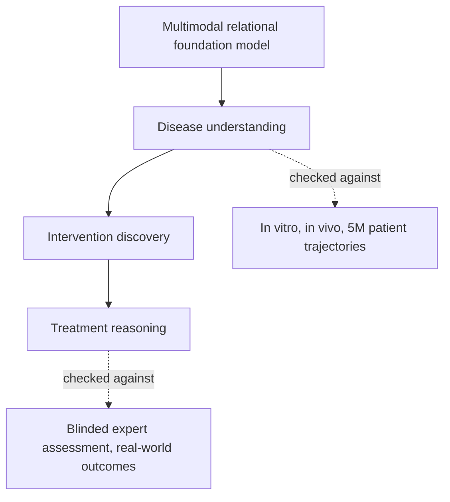
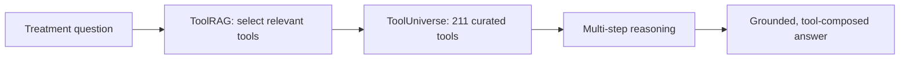
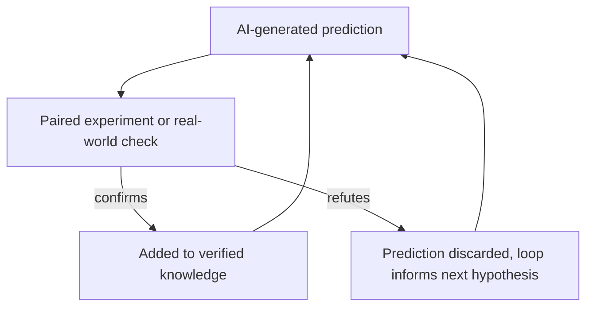

# Chapter 4: The closing vision, human-AI co-science

## Contents
- [What is it?](#what-is-it)
- [Why does it exist?](#why-does-it-exist)
- [How does it work?](#how-does-it-work)
- [What this means for you](#what-this-means-for-you)
- [Sources](#sources)

## What is it?

The closing keynote of ISMB 2026, delivered by Marinka Zitnik, argues for a specific and narrow definition of what an "AI scientist" should be: not a chatbot that answers biology questions fluently, but a system built and evaluated across three concrete capabilities, understanding disease mechanisms, discovering interventions, and reasoning about treatments, that partners with human researchers through a full discovery loop and is judged by whether its predictions survive contact with real experiments and real patients. This chapter gets more depth than the other three because it is the single talk in the whole conference closest to the shape of agentic search v4: a language model that reasons by calling curated tools and retrieving verifiable knowledge, rather than answering from what it memorized during training.

## Why does it exist?

Most AI-for-biology tools stop at one narrow question. You ask, a model answers, and nothing connects that answer back to a real experiment, a real patient outcome, or the next question a scientist would actually ask. The keynote's framing is a direct critique of that pattern: a system that only sounds right is not the goal. A system whose outputs get checked in a lab, in a patient cohort, or against a blinded expert panel, and hold up, is the goal. That reframing matters because it changes what counts as evidence of success. Fluency is cheap. Surviving an experiment is not.

The specific system inside the keynote that makes this concrete is TxAgent, an agent built for treatment reasoning, the hardest of the three capabilities Zitnik covers, because a real treatment decision has to weave together disease context, a patient's comorbidities, their current medications, and the sprawl of biomedical literature, all at once, with a wrong answer carrying real cost. TxAgent exists because no single fine-tuned model can hold that much shifting, source-specific knowledge in its weights reliably, so the answer has to come from retrieving and reasoning over live tools and live knowledge sources instead.

## How does it work?

### Three capabilities, one discovery loop

Zitnik organizes the keynote around three capabilities that build on each other rather than existing as separate demos.

Disease understanding starts from foundation models trained on multimodal relational data, meaning many different data types, genes, proteins, cells, patients, tied together as one graph rather than kept in separate tables. Because these models see relationships that no single dataset contains on its own, they surface disease mechanisms invisible to any one source. Zitnik reports hypotheses generated this way about Parkinson disease, bipolar disorder, and Alzheimer disease, each checked afterward in vitro, in vivo, and against the health trajectories of five million patients, an external validation step that is not optional set dressing but the actual claim to success.

Intervention discovery is the next layer: the AI scientist searches enormous experimental spaces to find candidate therapeutic targets, predicts synthetic lethal interactions in cancer (pairs of genes where disabling both kills the cell but disabling either alone does not), and models how an individual patient's tumor might respond to immunotherapy.

Treatment reasoning is the capability closest to agentic search v4, and it is where TxAgent lives.

### TxAgent: tools over parameters

TxAgent's design choice is the load-bearing idea of the whole talk: answer quality comes from retrieving and composing curated tools and knowledge at the moment of reasoning, not from cramming every fact into the model's weights ahead of time. The agent runs multi-step reasoning over a toolbox of 211 expert-curated tools, collectively called ToolUniverse, covering every FDA-approved drug since 1939 and clinical data sources including OpenFDA, Open Targets, and the Human Phenotype Ontology. A component called ToolRAG selects the right subset of tools for each reasoning step, so the agent is not searching all 211 tools blindly on every hop, it retrieves the relevant ones first, then reasons.

The published accuracy figure for this system is 92.1 percent on open-ended drug reasoning tasks, evaluated across five purpose-built benchmarks, DrugPC, BrandPC, GenericPC, TreatmentPC, and DescriptionPC, spanning 3,168 drug-reasoning tasks and 456 personalized treatment scenarios. On those benchmarks it outperformed both a leading proprietary general-purpose language model and a large open-weight reasoning model, which is a meaningfully broader and more rigorous evaluation than the keynote's own description of "blinded expert assessment in rare diseases" suggests on its own, the blinded expert review is a separate, additional check layered on top of the benchmark numbers, not a replacement for them. One naming note from the verification pass: the term ToolRAG is confirmed throughout the project's code repository and related materials, but does not appear word for word inside the fetched arXiv abstract text itself, so treat the term as accurate to the broader project rather than a phrase lifted directly from the paper's abstract.

### Scientific environments and the discovery loop

Zitnik names the unifying layer underneath all three capabilities scientific environments: infrastructure that connects language models to what she calls an open universe of scientific tools, rather than a fixed, hand-picked set built for one narrow task. The evaluation philosophy that goes with it is a discovery loop, where an AI prediction is paired with an actual experiment or a real-world outcome, and the loop only counts as evidence when that pairing closes, not when the prediction is generated.

## What this means for you

This talk is closer to a blueprint for agentic search v4 than any other single talk at the conference, and it validates the core architectural bet you are already making rather than introducing a new one.

Tools over parameters is the retrieval-augmented generation thesis, confirmed in exactly the domain v4 serves, at production scale, with a published accuracy number to point to. TxAgent's 92.1 percent on 3,168 drug-reasoning tasks is evidence that an agent grounded in curated, retrievable tools and current knowledge sources beats an agent trying to answer from parameters alone, even against strong general-purpose models. That is the argument for keeping v4's design centered on retrieval and tool composition rather than drifting toward "just fine-tune a bigger model and hope it knows enough."

ToolRAG is a specific, reusable pattern for a problem v4 will hit directly: when the tool or source library grows past a handful of options, you cannot let the agent search all of them on every query. Retrieve the relevant subset first, then reason over that subset. This is the same shape as the BioNeMo workshop's per-step model selection and Chorus's oracle-wrapping from Chapter 1, three independent talks converging on the same answer to the same problem.

Grounding in verifiable, named sources, OpenFDA, Open Targets, the Human Phenotype Ontology, is TxAgent's actual hallucination defense, and it is the same mechanism your nws-production-standards cite-or-refuse gate already requires: every claim ties to a specific retrieved source, or the system declines to answer. The discovery loop is the sharpest version of the eval-harness idea across the whole conference: a prediction only counts once it is checked against an experiment or a real outcome, not once it is generated fluently. If v4 ever needs a north-star evaluation philosophy beyond a static benchmark, this is it, judge outputs by whether they hold up when checked, not by how confident they sound.

The multimodal relational foundation model layer underneath disease understanding is the knowledge-graph half of your own stack, made concrete: a graph tying together genes, proteins, cells, and patients surfaces mechanisms that no single flat data source would reveal on its own, which is the argument for keeping a real graph structure in v4 rather than flattening everything into one text index. And the closing note on openness, an Open AI Scientists Initiative and open-sourced tooling, lines up directly with building v4 as your own open-source project rather than a closed, borrowed capability, which is the same choice your career strategy memory already names as owned capital over borrowed capital.

## Sources

| Session | Time | Paper status |
|---------|------|---------------|
| Foundations of human-AI co-science | Thursday 16:40-17:40 | Paper verified |
