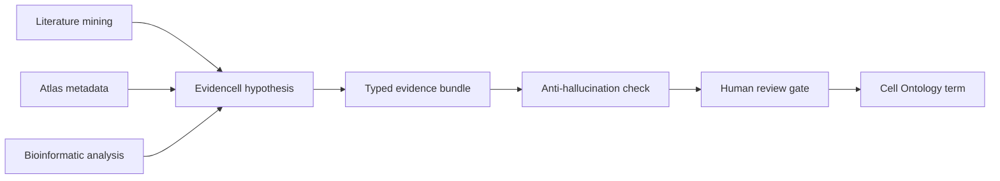
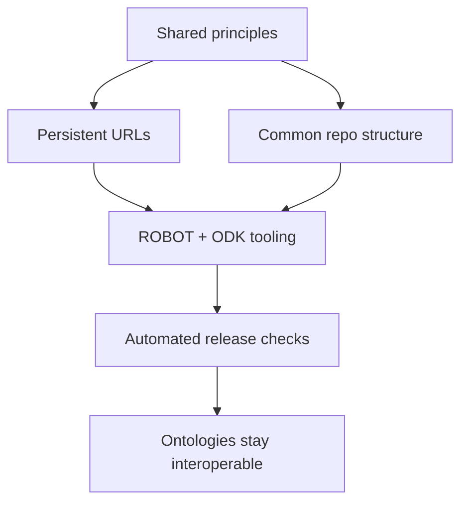

# Chapter 5: Ontologies and schemas as the shared vocabulary

## Contents
- [What is an ontology?](#what-is-an-ontology)
- [Why does it exist?](#why-does-it-exist)
- [How does it work?](#how-does-it-work)
- [What this means for you](#what-this-means-for-you)
- [Sources](#sources)

## What is an ontology?

An ontology is an agreed vocabulary of concepts and the relationships between them, written down so both people and machines use it the same way. "T cell" means the same specific thing whether a curator in one lab or an algorithm in a data pipeline uses it, because the term traces back to one shared definition with one stable identifier.

A schema is the structural cousin of an ontology. Where an ontology defines what a concept means, a schema defines how concepts get stored: which fields a node has, which relationship types are allowed, how confidence and source get recorded. A knowledge graph needs both. The ontology supplies the words. The schema supplies the grammar.

Four ISMB 2026 talks cover different layers of this shared-vocabulary problem: keeping a vocabulary current as biology changes (the Cell Ontology), designing a schema so graphs can talk to each other (the Cell Knowledge Network), governing hundreds of vocabularies so they do not drift apart (the OBO Foundry), and defending why any of this curated infrastructure still matters when a language model can already produce plausible-sounding answers on its own (the Martone keynote).

## Why does it exist?

Without a shared vocabulary, every project reinvents its own labels, and no two knowledge graphs can merge without a translation project first. The Cell Knowledge Network talk states the failure mode directly: if your node for "T cell" uses a different identifier than mine, the graphs cannot merge, no matter how good either graph is on its own (Session: "Developing a semantically interoperable knowledge graph schema to support single cell transcriptomics," Matthew Diller, Lincoln West).

Biology also keeps changing the vocabulary it needs. Cells have two competing definitions. The classical one names a cell by function, shape, location, and lineage, the kind of description a pathologist would give. The modern one names a cell by its transcriptomic profile, the set of genes it switches on, measured one cell at a time by newer atlas technologies. Connecting the two by hand does not scale to how fast atlases are growing (Session: "Bridging classical and transcriptomic cell types at scale: agentic AI workflows for the Cell Ontology," David Osumi-Sutherland, Lincoln West).

And a deeper question sits underneath both of those: in a world where a language model already seems to "know" that a CA1 pyramidal cell is a kind of hippocampal neuron without consulting any ontology, is curated vocabulary still worth the cost of maintaining it? That question is the spine of the Martone keynote, and it reappears as the closing argument of this whole part of the book.

## How does it work?

### Keeping a vocabulary current: agentic workflows for the Cell Ontology

The Cell Ontology talk describes two workflows that use AI to keep pace with atlas growth while keeping a human in the approval loop.

The first is a community workflow. A plain request on GitHub, "add this cell type," turns into a validated draft ontology term. The system checks each asserted fact against the cited literature and links the new term to atlas data before a human approves it.

The second, Evidencell, is a deep-search agent built specifically for atlas annotation. It combines three inputs: literature mining, atlas metadata, and bioinformatic analysis. It outputs a structured hypothesis mapping a transcriptomic cluster (a group of cells that behave alike in the data) to a classical cell type. Every mapping carries typed evidence rather than a single citation blob: literature excerpts with citations, marker gene overlaps, spatial expression, and electrophysiology or morphology data, each tagged with what kind of evidence it is.

The paper trail behind this talk, Osumi-Sutherland's "The Cell Ontology in the age of single-cell omics" (Scientific Data, 2026), confirms editors already use LLMs to draft cell type definitions with literature references for expert validation, and confirms exploration of an agentic literature-extraction tool called Aurelian. It does not surface a standalone "Evidencell" system anywhere in the public literature, so that specific piece of the talk remains a claim from the room rather than a documented one.

### Designing a schema so graphs can merge: the Cell Knowledge Network

The Cell Knowledge Network (CKN) is an NLM knowledge graph that ties single-cell experiment data to biological knowledge, and its schema is built from the start to interoperate with other graphs rather than stand alone.

Two design choices do the work. First, node and edge types are normalized to terms from biomedical ontologies, chiefly the Cell Ontology, the same vocabulary CELLxGENE and HuBMAP already use. Second, nodes, edges, and triple assertions (a triple is a subject-predicate-object statement, such as "T cell expresses CD3") are mapped to the Biolink Model, an upper-level data model designed so different biomedical graphs share the same categories and predicates.

On top of that shared structure, CKN adds edge properties for trustworthiness: a confidence measure and the source of each assertion, stored directly on the edge rather than in a separate table. Provenance travels with the fact, not beside it.

No dedicated paper for CKN's schema was found. The closest public record is a KG-Hub registry entry describing CKN as built from "validated computational analysis pipelines and natural language processing of scientific literature." The schema itself is public on GitHub at NIH-NLM/cell-kn-schema.

### Governing hundreds of vocabularies without central control

The OBO Foundry is the community that coordinates interoperable open ontologies for the life sciences, and its 2026 status talk frames the challenge as no longer "how do we build ontologies" but "how do we keep hundreds of them from drifting apart."

The Foundry runs on shared principles and governance, not central control. Its technical backbone is three things: persistent URLs (stable web addresses that never break), shared repository structures, and lightweight web infrastructure. Two tools do the heavy lifting: ROBOT and the Ontology Development Kit automate release workflows, quality checks, and mapping between ontologies. The core stance is to treat ontology building as an engineering discipline: versioning, automated checks, continuous integration, the same rigor a software team applies to a codebase.

The most recent public status paper found dates to 2021, not a 2026 update, but it confirms the mechanics: a volunteer operations committee, a public compliance dashboard scoring ontologies against 13 checkable principles, four principles at 100 percent compliance across 175 active ontologies, and "textual definitions" as the weakest at roughly 11 percent compliance. Publishing that dashboard drove voluntary improvement, evidence that a visible quality metric changes curator behavior even without an enforcement mechanism behind it. The community is now starting to fold AI-assisted approaches into curation and development, the same direction the Cell Ontology talk demonstrates concretely.

### Why the vocabulary survives contact with language models

The Martone keynote makes the argument that ties the other three talks together: ontologies and large language models are partners, not rivals, and the value of an ontology is shifting rather than disappearing.

Her case rests on one distinction. A language model's "knowledge" drifts with training data and phrasing. It cannot guarantee the same answer twice, and it cannot guarantee the answer is grounded in anything checkable. A human-curated ontology is a stable anchor in a knowledge landscape that keeps shifting underneath it: a fixed, agreed reference point a probabilistic model cannot promise on its own. She uses a sociology-of-science lens, looking at when a field actually reaches consensus on a concept, to decide when something has earned stable representation, which matters in a field like neuroscience where even brain regions and cell types still lack full consensus.

The flip side of her argument is that AI is the technology that finally lets the field build comprehensive knowledge artifacts at a scale that was previously impossible, and hand domain experts tools to use them, which is exactly what the Cell Ontology talk demonstrates in practice. So the relationship runs both ways: AI helps build and exploit ontologies, and ontologies keep AI grounded.

No dedicated 2026 paper exists for this keynote. The closest authored statement of the theme, Larson and Martone's "Ontologies for Neuroscience: What Are They and What Are They Good For?" (Frontiers in Neuroscience, 2009), confirms the underlying claim: an ontology is a formal representation using first-order logic and standardized relationships, not just a controlled vocabulary, useful for annotation, retrieval, and cross-scale reasoning. The 2026 keynote extends a seventeen-year-old argument rather than inventing a new one.

## What this means for you

Agentic search v4 will eventually need to normalize entities, whether genes, diseases, or cell types, to something more stable than raw text strings. These four talks give you a working design, not just a philosophy.

Steal the typed-evidence pattern from Evidencell: instead of attaching one citation to a claim, attach evidence with a kind (literature excerpt, marker overlap, spatial data) so downstream reasoning can weigh sources by type, not just count them. Normalize to shared ontologies and the Biolink Model at ingest time, the way CKN does, not after the fact. Merging an external graph later becomes a package install rather than a research project if your schema already speaks the same vocabulary. And when someone asks why you are building on curated ontologies instead of just trusting an LLM's internal knowledge, the Martone argument is your answer: the ontology is the stable anchor that keeps model output grounded and consistent over time, and the LLM is what lets you build and query that anchor at a scale that used to be impossible.

The OBO Foundry's dashboard lesson generalizes past ontologies. A public, automated compliance score changed curator behavior even without an enforcement mechanism. If v4 accumulates its own graph or terminology over time, publishing a similar quality dashboard against a fixed checklist may do more for data quality than any manual review policy.

## Sources

| Session | Time | Paper status |
|---------|------|---------------|
| Bridging classical and transcriptomic cell types at scale: agentic AI workflows for the Cell Ontology | Monday 14:20-14:40 | Paper verified |
| Developing a semantically interoperable knowledge graph schema to support single cell transcriptomics | Monday 14:40-15:00 | No public paper found (verified) |
| Keynote: AI and ontologies, the beginning of a beautiful friendship | Monday 16:40-17:40 | Paper verified |
| The OBO Foundry in 2026 | Tuesday 12:40-13:00 | Paper verified |
