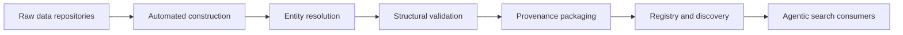
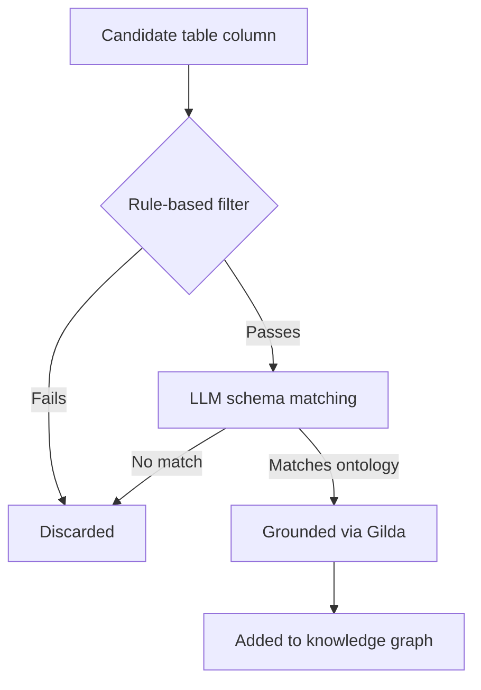

# Chapter 6: Registries, provenance, and quality control

## Contents
- [What is this layer?](#what-is-this-layer)
- [Why does it exist?](#why-does-it-exist)
- [How does it work?](#how-does-it-work)
- [What this means for you](#what-this-means-for-you)
- [Sources](#sources)

## What is this layer?

Chapter 5 covered the vocabulary a knowledge graph speaks. This chapter covers the plumbing that turns raw, messy sources into a graph you can trust, and then keeps other people from having to rebuild it from scratch.

Six ISMB 2026 talks together sketch the full lifecycle: building a graph automatically from repositories (ORION and DGLink), resolving ambiguous entity names before they corrupt it (Gene Harmony), validating its structure before anyone builds on it (KGXVal), packaging the story of how it was made (FAIRSCAPE), and cataloging it so the next person can find it instead of starting over (KG-Registry). None of these tools predict anything. They are infrastructure: the unglamorous work that decides whether a graph is trustworthy enough for someone else to build on.

## Why does it exist?

Biomedical data is FAIR in principle (Findable, Accessible, Interoperable, Reusable) but rarely FAIR in practice. The FAIR knowledge graphs talk names the gap directly: different identifier systems, different semantic models, and different provenance conventions mean that stitching together the exact graph a research question needs is a slog, so most teams either use one giant one-size-fits-all graph or rebuild integration themselves (Session: "FAIR knowledge graphs on-demand," Chris Bizon, Cabinet).

Even when a graph gets built, nobody automatically knows it is correct. Sources carry wrong annotations, identifier normalization introduces its own mapping errors, and the exchange standard itself cannot always represent every case cleanly (Session: "KGXVal: quality control for biomedical knowledge graph harmonization," Daniel Korn, Lincoln West). And even when a graph is correct, nobody can find it. Even expert investigators struggle to know which graphs exist, how they were built, how to access them, and how they relate to each other, because no shared registry answered those questions before now (Session: "KG-Registry: the open registry of knowledge graphs and their provenance," J. Harry Caufield, Lincoln West).

Underneath all of it sits a quieter failure mode: silent misidentification. A single gene symbol can point to two different genes, an alias collision that breaks any tool aggregating or linking data by symbol without anyone noticing (Session: "Curating gene symbol relationships to resolve gene symbol ambiguity," Anastasia Bratulin, Lincoln West).

## How does it work?

### Building graphs from raw sources: ORION and DGLink

ORION is a graph-building framework underneath the ROBOKOP system. It ingests a source, normalizes identifiers (mapping different IDs for the same thing to one), harmonizes semantic types and predicates to the Biolink Model, preserves provenance, and emits a reusable graph module. The published paper confirms ORION's name in full: Operational Routine for the Ingest and Output of Networks. The ROBOKOP Graph Repository is the distribution layer on top: users discover, retrieve, and compose prepared modules with package-manager mechanics, so assembling a custom graph becomes closer to installing packages than running a research project.

DGLink automates the same idea for a different starting point: entire data portals rather than single sources. It crawls a portal's studies and experimental files and extracts semantic annotations through named entity recognition (finding biomedical entities in text), then normalizes them against seven key ontologies (HGNC, UniProt, ChEBI, MeSH, DOID, HP, EFO) using a grounding tool called Gilda, which maps a mention like "TP53" to its exact ontology identifier. Unlike prior tools that annotate only study-level metadata, DGLink does schema-free ingestion of both tables and modality-specific files such as VCF and DICOM, so it captures the richer content buried inside the actual experimental files, not just the summary description on top.

To keep automated table annotation from flooding the graph with false positives, DGLink runs three column-selection strategies in sequence.

The resulting graph follows the Biolink data model and is queryable three ways: a Neo4j graph database, a semantic-search web interface, and an LLM chat interface exposed through a Model Context Protocol (MCP) server, a standard way to hand tools and data to an AI agent. Across three portals it reported 96 to 100 percent tabular coverage, 0.819 F1 on LLM-based schema matching, and 96 percent grounding accuracy through Gilda. No public paper for DGLink was found, though its authors were confirmed as Woodward Galbraith and Benjamin M. Gyori of the Gyori Lab for Computational Biomedicine.

### Resolving entities before they corrupt the graph: Gene Harmony

Gene symbols are used everywhere, but naming guidelines are often ignored in practice, and a single symbol can point to more than one gene. The talk's example: "BCR" is the primary symbol for one gene and also an alias for a second, unrelated gene, one clinically important in cancer fusions and the other uncharacterized. Any tool that links or aggregates data by symbol inherits that ambiguity silently.

Gene Harmony fixes this by curating explicit relationships between gene symbols and gene concepts, a gene concept being the stable underlying gene, kept separate from the fuzzy text symbol that names it. Curators assign relationship labels, primary, alias, or collision, using a mix of manual, programmatic, and automated methods. Recording which symbol maps to which concept, and how, lets a machine disambiguate a symbol automatically instead of guessing. The resource is meant to feed harmonization workflows in aggregation tools like DGIdb and MetaKB.

The pre-brief cited a 7.8 percent alias-collision rate in Ensembl. The verified poster gives a different, more precise number from a different scope: 3,940 gene records (2.3 percent) contain aliases that identically match another gene's primary symbol, using KRAS as the worked example instead of BCR. The two figures likely measure different things (a collision rate versus a record-level match rate), so both should be treated as approximate estimates of the same underlying problem rather than the same statistic twice.

### Validating structure before anyone builds on it: KGXVal

KGX is a shared exchange standard for biomedical knowledge graphs. Converting many sources into KGX format and normalizing them against shared ontologies is imperfect work, and finding the resulting errors by hand takes specialized tooling and heavy expert time.

KGXVal is a Python tool that automates the check. It takes KGX-formatted files and produces three outputs. Summary statistics show how often each combination of node and edge type labels appears, so outliers stand out immediately. Stratified samples pull a representative slice of each type-combination so a curator can spot-check without reading everything. A full violation list records every place the file breaks the KGX model, both before and after normalization. All three outputs land in ordinary spreadsheet files, so a curator opens the report in Excel with no extra tooling required.

The talk reported over 3,100 previously undetected schema errors across 26 harmonized sources. That specific figure could not be independently confirmed. The pre-brief's related-work link turned out to point to a different, broader knowledge graph evaluation paper rather than a KGXVal-specific publication, so the error count should be treated as an unverified claim from the room, not a documented result, pending a dedicated KGXVal paper.

### Packaging the "how was this made" story: FAIRSCAPE

Most explainability work looks at the model. FAIRSCAPE looks at everything before the model: the cleaning, segmenting, embedding, and feature-derivation steps that are usually opaque. If you cannot trust how the data was prepared, the argument goes, you cannot trust what the model does with it, especially in sensitive decisions.

FAIRSCAPE scores 28 AI-readiness criteria across seven categories: FAIRness, provenance, characterization, pre-model explainability, ethics, sustainability, and computability. It packages data and metadata as RO-Crates (Research Object Crates, a standard way to bundle data with machine-readable metadata) using schema.org and PROV vocabularies, PROV being a standard for recording the who-what-when of how an artifact was produced. It builds component-resolvable provenance graphs, meaning any single piece of output can be traced back through its exact production steps, alongside a human-readable datasheet a non-specialist can read directly.

Newer work layers graph-RAG (retrieval-augmented generation run over the provenance graph itself, not the content) on top, producing audience-targeted interpretations and flagging issues like data leakage as severity-coded annotations stored back into the same graph. That is provenance treated as a queryable knowledge source in its own right, not a static log file nobody reads.

### Finding the graph that already exists: KG-Registry

KG-Registry is an open catalog holding metadata for more than 760 data sources, including 135 knowledge graphs and over 4,800 derived products. Each entry is plain Markdown with a YAML front matter header (structured key-value fields at the top of a text file), a format both people and agentic AI tools can read and curate without special tooling.

Each entry records how a source is distributed, transformed, accessed, and related to others, plus product-level provenance, meaning the origin and processing history of each derived artifact, not just the parent graph. License, repository, activity status, domain, and standards compatibility are all captured. The schema itself is written in LinkML, a modeling language, so registry entries plug directly into LinkML's validation tooling.

The predecessor system, KG-Hub, confirms the technical ancestry: a standardized ETL pipeline using the KGX and Koza tools, Biolink Model compliance, automated versioned builds with permanent URLs, OBO Foundry ontology integration, and storage on AWS S3. At the time of that earlier paper it hosted seven biomedical KG projects, from COVID-19 research to microbial phenotypes, ranging from hundreds of thousands to millions of nodes and edges. KG-Registry is that same discipline applied to cataloging graphs across the whole field, not just the ones one team builds.

## What this means for you

If agentic search v4 ever builds or ingests a knowledge graph, this chapter is close to a reference architecture for the pipeline around it, not just an inspiration.

Construction: DGLink's pattern, named entity recognition plus ontology grounding through Gilda, feeding a Biolink-conformant graph exposed over an MCP server, is close to a working blueprint for v4's own ingest half. Entity resolution: Gene Harmony's symbol-versus-concept separation is exactly the discipline your grounding step needs to avoid silently linking a fact to the wrong gene, a failure mode that produces confidently wrong answers with no visible error. Validation: a KGXVal-style gate, deterministic schema checks producing a human-reviewable spreadsheet, belongs in your pipeline before any graph reaches downstream reasoning, the same lesson your own linkml-reference-validator work already teaches. Provenance: FAIRSCAPE's RO-Crate-plus-PROV packaging, and especially its graph-RAG-over-provenance idea, is worth stealing outright. Running retrieval over the provenance graph itself, not just the content, lets an answer explain how its evidence was produced, not only what the evidence says. Discovery: a KG-Registry-style catalog, plain Markdown plus YAML so both a person and an agent can maintain it, is the natural index for v4 to consult before deciding which knowledge graph to query for a given question, rather than hardcoding one graph as the only source.

The throughline across all six talks: none of them treat "we built a graph" as the finish line. Construction, resolution, validation, provenance, and discovery are five separate, necessary steps, and skipping any one of them is where trust quietly leaks out of a knowledge graph before an agent ever queries it.

## Sources

| Session | Time | Paper status |
|---------|------|---------------|
| FAIR knowledge graphs on-demand | Monday 12:30-12:50 | Paper verified |
| KGXVal: quality control for biomedical knowledge graph harmonization | Tuesday 11:20-11:40 | No public paper found (verified) |
| KG-Registry: the open registry of knowledge graphs and their provenance | Tuesday 11:40-12:00 | Paper verified |
| Curating gene symbol relationships to resolve gene symbol ambiguity | Tuesday 12:20-12:40 | Paper verified |
| FAIRSCAPE: pre-model AI-readiness and interpretability for biomedical data | Tuesday 12:20-12:40 | Paper verified |
| DGLink: automated knowledge graph construction from data repositories | Tuesday 16:40-17:00 | No public paper found (verified) |
