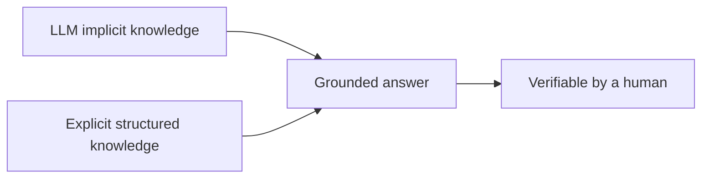

# Chapter 7: Structured knowledge in a genAI world

## Contents
- [What is this debate?](#what-is-this-debate)
- [Why does it exist?](#why-does-it-exist)
- [How does it work?](#how-does-it-work)
- [What this means for you](#what-this-means-for-you)
- [Sources](#sources)

## What is this debate?

Every talk in the previous two chapters assumed curated, structured knowledge is worth building: ontologies worth maintaining, schemas worth designing, graphs worth validating and cataloging. This closing chapter covers the one talk that puts that assumption on trial directly.

"In a genAI world, does structured knowledge still have a role in science?" is a perspective talk contrasting two ways of holding scientific knowledge. Implicit knowledge is what a language model encodes inside billions of numeric weights and expresses fluently as text, with no explicit, inspectable structure behind it. Explicit knowledge is what an ontology, a knowledge graph, or a relational database captures: relationships in a formal structure with defined semantics, something you can query and verify (Session: "In a genAI world, does structured knowledge still have a role in science?" Karin Verspoor, Lincoln East).

## Why does it exist?

Foundation models have absorbed vast amounts of scientific knowledge and can reproduce it fluently through plain language. That is genuinely useful, and it is also a direct threat to any field, like bioinformatics, that has spent decades building its value on painstakingly curated, structured knowledge. The open question is uncomfortable and simple: if a model already seems to "know" the relationships, do we still need the ontologies and databases that took years to build?

The live notes from the room sharpen why this question has teeth rather than staying abstract. Searching for a relevant paper feels like missing 99 percent of what is actually out there. Part of the friction is the nomenclature itself: searching PubMed by disease and protein name is frustrating precisely because free text does not resolve synonyms or ambiguity the way a controlled vocabulary over concepts and relations would. That frustration is a lived argument for structure, from inside the search experience that structure is supposed to fix.

## How does it work?

Verspoor does not declare a winner. The talk explores the tensions and the connections between implicit and explicit knowledge rather than dismissing either side, deliberately raising hard questions about where each paradigm can actually be trusted.

The closest related published work found, on "Rosetta Statements," proposes a specific bridge between the two paradigms rather than picking one. Instead of requiring every contributor to have upfront ontology expertise, it models knowledge as English natural-language statements, using Wikidata as the substrate, so domain experts can contribute without semantic training. In that framing, LLMs get a defined, bounded role: an accessibility layer for data entry and display, not a replacement for the underlying structured, machine-actionable graph. The model helps people talk to the structure. It does not become the structure.

That bridge is a useful frame for reading back across this entire part of the book. Chapter 5's ontologies are explicit knowledge that stays stable while a model's weights drift with each retraining. Chapter 6's registries, validators, and provenance tools exist because explicit knowledge only earns trust when its construction and quality are checkable, something a model's fluent output cannot offer on its own. Nothing in either chapter argues against using language models. The Cell Ontology's agentic workflows and DGLink's LLM-based schema matching both use language models directly, inside a structure that keeps their output checkable. The pattern across ten talks is not "structure instead of genAI." It is "genAI to build and query structure, structure to keep genAI honest."

## What this means for you

This talk names the exact bet agentic search v4 is making, and the rest of this part of the book is the evidence for one side of it. Your architecture already answers Verspoor's question in practice: use the LLM for language and reasoning, but anchor every claim to explicit, verifiable structure through retrieval-augmented generation, knowledge graphs, and provenance. The talk is worth reading directly as ammunition for that choice, especially the trust argument: implicit knowledge cannot be audited after the fact, and an unauditable answer is not a safe foundation for a biomedical search system.

The live-notes detail about PubMed search frustration is a small but concrete design signal. If a domain expert in the room finds keyword search over disease and protein names frustrating because it does not resolve synonyms, that is a direct argument for the entity resolution and ontology-normalization work in chapters 5 and 6, not an abstract one. It is the same problem Gene Harmony solves for gene symbols, generalized to disease and protein search. When you scope v4's retrieval layer, treat "does this query resolve synonyms through a controlled vocabulary" as a concrete, testable requirement, not a nice-to-have.

The honest caveat: this is a perspective talk with no dedicated paper, built to provoke discussion rather than report a result. Treat its framing as a well-posed question worth carrying into your own design reviews, not as a settled finding you can cite as proof either way.

## Sources

| Session | Time | Paper status |
|---------|------|---------------|
| In a genAI world, does structured knowledge still have a role in science? | Tuesday 14:20-15:00 | Paper verified |
