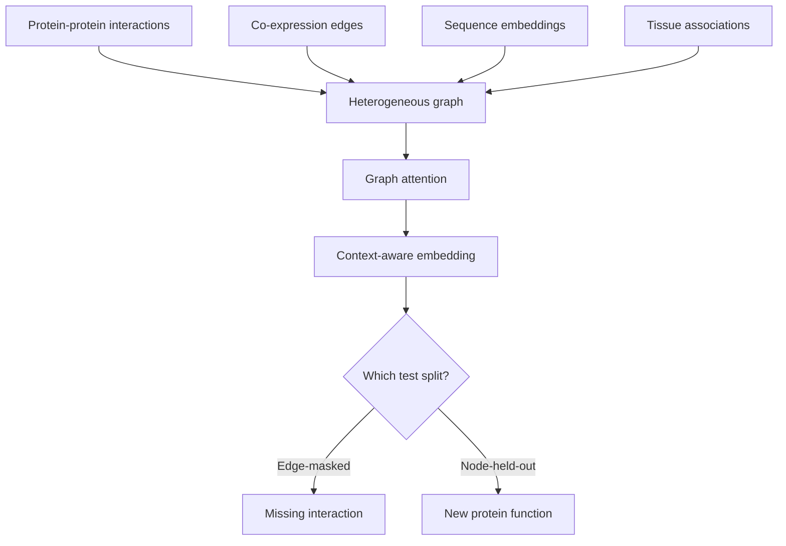
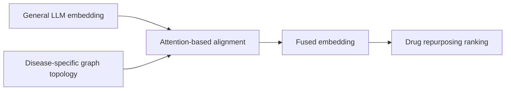
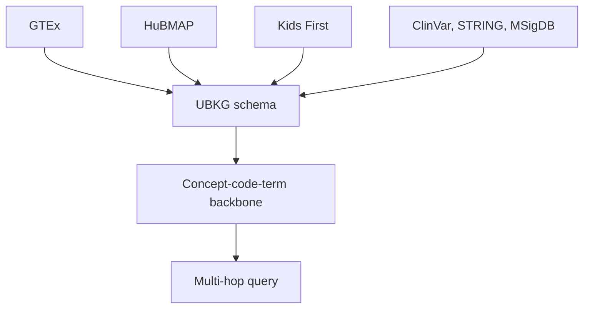

# Chapter 8: Embeddings that encode biological context

## Contents
- [What is a context-aware embedding?](#what-is-a-context-aware-embedding)
- [Why does it exist?](#why-does-it-exist)
- [How does it work?](#how-does-it-work)
- [What this means for you](#what-this-means-for-you)
- [Sources](#sources)

## What is a context-aware embedding?

An embedding is a list of numbers that stands in for something complicated, a protein, a drug, a disease, so a computer can measure how similar two things are by comparing their number lists instead of their raw structure. A context-aware embedding is the same idea with one addition: the numbers are shaped by the specific biological relationships around the thing, not just its own properties in isolation.

Think of it like describing a person. "Alex is 5 foot 10" is a plain fact, useful on its own. "Alex is the goalkeeper on a team that just won the league" is context. The second description tells you what Alex does inside a network of relationships. A context-aware embedding tries to bake that second kind of description into a vector of numbers.

## Why does it exist?

Two of the three talks in this chapter (Session: "GATSBI: context-aware protein embeddings", Gowri Nayar, NetBio; Session: "From general-purpose to disease-specific features: aligning LLM embeddings on a biomedical KG", Suman Pandey, NetBio) exist to fix the same gap from two different directions.

Plain embeddings, whether built from a protein's amino acid sequence or from a large language model's general training, carry broad, generic meaning. They do not know that a specific drug sits three hops from a specific disease inside a specific knowledge graph. For a narrow scientific question, drug repurposing for one disease, or annotating a protein nobody has studied, that missing context is exactly the information you need.

The third talk (Session: "The NIH Common Fund Data Ecosystem Data Distillery Knowledge Graph (UBKG)", Deanne M. Taylor, NetBio) supplies the substrate the other two lean on: a large, ontology-aligned graph that already has the relationships worth encoding.

There is also an honesty problem underneath all of this. Most protein embedding methods are graded on well-studied proteins with easy test splits. That overstates how well they will do on the proteins researchers actually need help with, the understudied ones. GATSBI's real contribution is exposing this gap, not just building a better embedding.

## How does it work?

### GATSBI: honest evaluation exposes real gains for understudied proteins

GATSBI builds a heterogeneous network, a graph with several different kinds of edges layered on top of the same proteins: physical protein-protein interactions, co-expression (genes that turn on and off together), sequence-derived representations, and tissue-specific associations. It then learns embeddings using graph attention, a mechanism where each node decides how much weight to give each neighbor when gathering information, rather than treating every neighbor equally.

The paper backs this with real scale: ESM-2 sequence embeddings for 20,074 human proteins, STRING physical interactions (16,462 nodes, 217,092 edges), STRING co-expression (11,205 proteins, 151,067 edges), and HumanBase tissue-specific networks (17,617 proteins, over 1.2 million edges), fused into one graph of 18,049 nodes and 1,575,310 edges.

The real contribution is the evaluation discipline. Different biological questions need different kinds of test splits:

- Predicting a missing interaction between two known proteins needs an edge-masked split: hide some edges, see if the model recovers them.
- Annotating a brand-new protein needs a node-held-out split: hold out entire proteins the model never saw, called inductive evaluation, because a real new protein was never in the training graph at all.

Against the Pinnacle baseline, GATSBI wins clearly on edge-masked interaction prediction (AUROC 0.878 versus 0.800) and functional set prediction (AUROC 0.804 versus 0.554), and is comparable on the harder node-held-out task. The gap is widest exactly where it matters most: for understudied proteins, GATSBI beats Pinnacle by 0.259 AUROC and 0.290 AUPRC under the edge-split evaluation, and still wins under the harder inductive split (AUROC 0.632 versus 0.522).

### CLEAR: bending general embeddings toward a disease-specific graph

CLEAR, short for Contextualizing LLM Embeddings via Attention-based gRaph learning, starts from the opposite direction. Instead of building a graph-native embedding from scratch, it takes a general-purpose large language model embedding, one that already carries broad textual meaning, and reshapes it using the connection structure (the topology) of a disease-specific knowledge graph. A drug's embedding gets pulled toward its actual neighbors in the disease graph, so the vector ends up carrying both general semantics and domain-specific structure.

This matters most when data is sparse, which is exactly when a confident but ungrounded language model is most likely to produce a plausible-sounding wrong answer. Tested on five benchmarks, CLEAR improved F1 score by up to 30 percent over prior methods: Cdataset (+26 percent), Fdataset (+8 percent), Ydataset (+23 percent), LAGCN (+2 percent), and LRSSL (+30 percent).

Applied to Alzheimer disease and related dementias, using a knowledge graph covering 2,285 FDA-approved drugs, 912 neurodegenerative diseases, and 4,042 therapeutic proteins, CLEAR reached F1 0.989 against a baseline of 0.815, and correctly recovered known therapeutic relationships. It also surfaced a specific new candidate: dextromethorphan, flagged for Alzheimer disease with supporting Gene Ontology enrichment.

### UBKG: the shared graph substrate these embeddings can align to

The Data Distillery Knowledge Graph is what CLEAR's method needs to exist somewhere real: a large graph with actual, ontology-grounded structure to align an embedding against. Built on the Unified Biomedical Knowledge Graph (UBKG) framework and the Petagraph schema, it harmonizes over 180 ontologies and data sources into a UMLS-like concept-code-term schema, a shared backbone of concepts, the codes that name them, and the terms people use for them. It integrates GTEx, HuBMAP, Kids First, LINCS, Metabolomics Workbench, ClinVar, STRING, and MSigDB, and supports multi-hop queries, following a chain of relationships across data types in one traversal, most completing in seconds.

One of its eight documented use cases: a congenital heart defect analysis that identified 27 genes, including established cardiac regulators GATA4, GATA5, NKX2-5, and TBX20, independently validated by STRING enrichment analysis (FDR below 1e-5).

## What this means for you

Graph-native prediction and plain retrieval are different tools for different jobs, and this chapter is where the boundary is clearest. A general embedding, the kind a retrieval system already uses to find relevant text, is the right tool when the question is broad and the evidence is abundant. It gets worse, not better, when the question is narrow, the data is sparse, and the correct answer depends on a specific web of relationships a text corpus does not spell out in one place. That is exactly when a graph-aligned embedding like CLEAR, or a graph-native one like GATSBI, earns its cost.

The evaluation discipline in GATSBI is the sharpest lesson to steal directly. If agentic search v4 is only tested on popular, well-covered topics, the reported performance overstates how the system will do on the long tail, the queries where users actually need the most help. Build held-out, inductive test sets on purpose: hide whole documents or entities the system never saw, not just individual facts, the same way GATSBI holds out whole proteins rather than just individual edges.

UBKG is the most directly usable artifact in this chapter. It is a working, NIH-scale, ontology-harmonized knowledge graph you could realistically query and cite against today, not a research prototype. If agentic search v4 needs a substrate to ground biomedical claims in structure rather than free text, this is a concrete candidate to evaluate, and its concept-code-term schema is the same backbone that already connects to NLM's UMLS work.

## Sources

| Session | Time | Paper status |
|---------|------|---------------|
| GATSBI: context-aware protein embeddings | 14:20-14:40 | Paper verified |
| The NIH Common Fund Data Ecosystem Data Distillery Knowledge Graph (UBKG) | 14:40-15:00 | Paper verified |
| From general-purpose to disease-specific features: aligning LLM embeddings on a biomedical KG | 15:20-15:40 | Paper verified |
