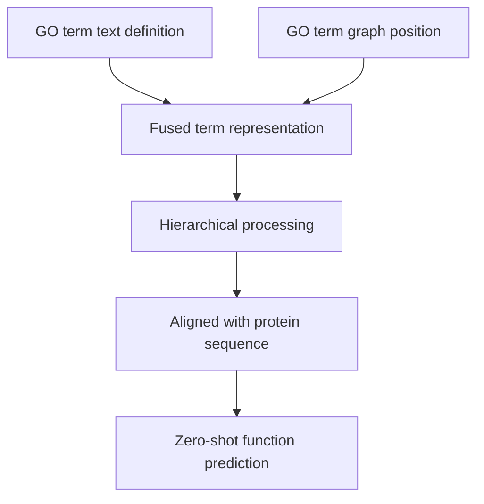
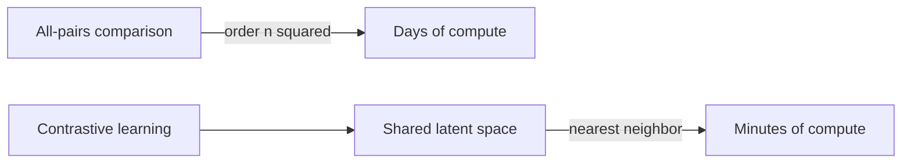
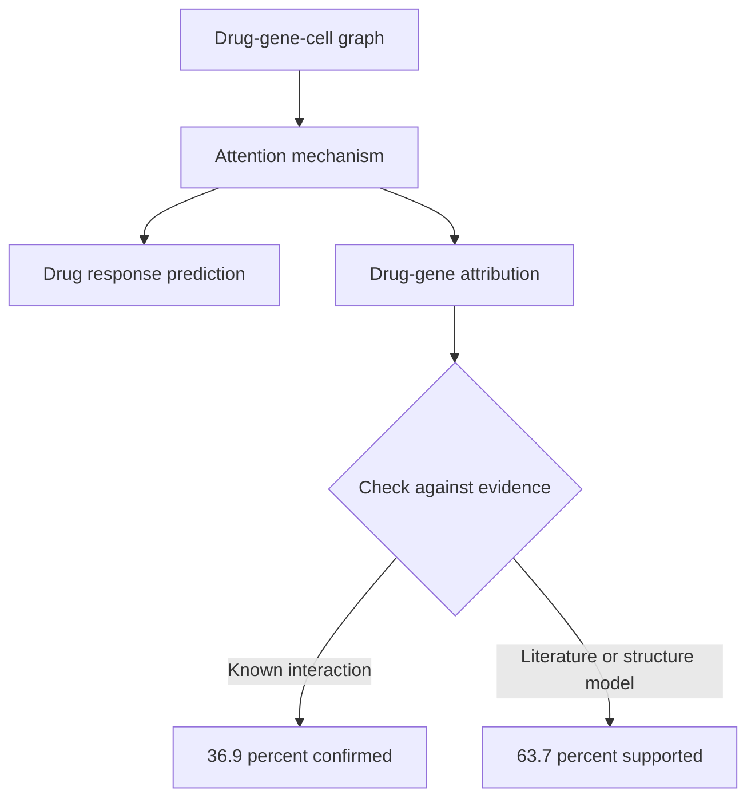

# Chapter 9: Graphs that predict function and interaction

## Contents
- [What is graph-based function and interaction prediction?](#what-is-graph-based-function-and-interaction-prediction)
- [Why does it exist?](#why-does-it-exist)
- [How does it work?](#how-does-it-work)
- [What this means for you](#what-this-means-for-you)
- [Sources](#sources)

## What is graph-based function and interaction prediction?

Most of biology is relational. What a protein does depends on what it touches: other proteins, pathways, drugs, diseases. A graph-based prediction system stores those relationships as a network, nodes for the biological entities and edges for how they connect, and then uses the shape of that network to predict a relationship nobody has measured yet. Instead of asking "what does this protein look like," it asks "who does this protein sit next to, and what does that tell me."

## Why does it exist?

Experimental measurement cannot keep pace with the entities that need annotating. New protein sequences accumulate far faster than labs can test what each one does. Kinase-substrate biology (which enzyme adds a phosphate to which protein) is well mapped, but the mirror process, phosphatases removing that phosphate, is not, because phosphatases got far less experimental attention. Predicting which drug will work on a given cell line, and being able to say why, still has no experimental shortcut. Comparing every protein in a microbial proteome against every other protein by brute force is mathematically expensive: with n proteins, that is roughly n-squared comparisons, which turns into days of compute.

The five talks in this chapter all attack a version of the same gap, missing experimental coverage, using graph structure to fill it faster and cheaper than a wet lab could.

## How does it work?

### STAR-GO: fusing text and graph structure for zero-shot function prediction

STAR-GO (Session: "STAR-GO: hierarchical ontology-informed protein function prediction", Gökçe Uludoğan, BOKR) predicts what a protein does by tagging it with Gene Ontology (GO) terms, the controlled vocabulary of biological functions. Most prior models lean on either the plain text definition of a GO term or its position in the ontology graph, not both. STAR-GO fuses them: it builds one representation per GO term from both its textual definition (semantic content) and its structural position in the ontology (which terms are its parents and children), processed hierarchically so information flows from general terms down to specific ones. Those fused term representations are then aligned with protein sequence embeddings to learn how sequence maps to function.

Because the model understands a GO term from both its meaning and its graph neighborhood, it can predict terms it never saw during training, called zero-shot prediction. That matters because the Gene Ontology keeps growing, and a model that only memorizes a fixed vocabulary goes stale the moment new terms are added.

### GO-CAM: curated causal graphs instead of flat annotations

A single GO annotation, "gene X has kinase activity," tells you a fact in isolation. It does not tell you what that activity causes next. GO-CAM (Session: "GO-CAM: curated pathways using GO and new tools", Paul Thomas, BOKR) links individual gene activities into causal models: each annotation becomes a node, and the causal influence one activity has on the next becomes a directed edge, building a small mechanistic circuit instead of a list.

The 2026 update reports the collection has grown nearly five-fold to 1,571 expert-curated pathway models as of July 2025: 907 for human genes (covering 1,606 gene products), plus 275 for mouse, 197 for budding yeast, 81 for fission yeast, and 67 for fruit fly. New tooling, including a Pathway Widget visualization and API access, makes these causal graphs programmatically usable rather than something a curator has to read one paper at a time.

This is a curated, expert-provenanced graph, not a predicted one, and it belongs in this chapter as the ground truth other methods are ultimately trying to approximate: mechanistic, causal, and traceable to the person who curated it.

### FlashPPI: turning quadratic comparison into linear-time retrieval

Predicting protein-protein interactions across a full proteome (the complete set of proteins an organism makes) traditionally means comparing every protein against every other, order n-squared work that takes days. FlashPPI (Session: "Linear-time prediction of proteome-scale microbial protein interactions", Andre Cornman, MLCSB) reframes the whole problem as retrieval instead of comparison. Using contrastive learning, it places each protein in a shared latent space (a coordinate system of numbers) where interacting partners land near each other. Finding partners becomes a nearest-neighbor lookup, order n work, instead of an all-versus-all scan.

The signal driving this comes from a genomic language model trained on metagenomic sequences, which has learned cross-protein co-evolution, the pattern where two proteins that physically interact tend to accumulate mutations together over evolutionary time. The result is four times better than prior sequence-based methods, matches structure-folding models at a fraction of the compute cost, and cuts proteome-wide screening from days to minutes. It is served live at seqhub.org alongside functional annotation and genomic context.

### PSNet: heterogeneous graphs recover the phosphatase-substrate map kinases already have

PSNet (Session: "Predicting phosphatase-substrate association using a heterogeneous knowledge graph", Marzieh Ayati, NetBio) targets a specific coverage gap: kinase-substrate pairs (which enzyme adds a phosphate) are well mapped, phosphatase-substrate pairs (which enzyme removes it) are not. Existing methods either cover only a handful of phosphatases or rely on sequence motifs alone, which cannot reliably tell specific pairs apart.

The method builds a heterogeneous knowledge graph, one with several node and edge types at once: phosphatases, kinases, substrates, drugs, and diseases, connected by phosphatase-substrate interactions, kinase-substrate associations, protein-protein interactions, pathways, disease annotations, and drug-target links. It learns Node2Vec-style network embeddings for each entity and feeds them into a supervised classifier to predict new associations. The reported result, AUC 0.97 on the Human Dephosphorylation Database, is sourced from the conference abstract and was not independently confirmed against a full published paper. What is confirmed, from a closely related report by the same research group, is the core finding: different edge types each contribute complementary predictive signal, which is the argument for integrating many relationship types rather than relying on one.

### drGT: attention as an explanation, literature as the check

drGT (Session: "drGT: attention-guided gene assessment of drug response", Yoshitaka Inoue, NetBio) predicts how a cell line, a lab-grown population of cells, responds to a drug, and it uses attention, a mechanism that learns how much weight each connection deserves, to point at the specific genes that explain the prediction. That combination matters because clinical use needs both an accurate answer and a believable reason for it.

The model builds a heterogeneous graph over drugs, genes, and cell lines, and is tested on deliberately hard generalization splits: random, unseen-drug, unseen-cell, and zero-shot (both drug and cell line unseen during training). drGT was the only model in the comparison with positive predictive value for unseen drugs, reaching zero-shot AUROC 0.786, the highest of all models compared, alongside random-split AUROC up to 0.945, unseen-cell-line AUROC 0.706, and unseen-drug AUROC 0.844, validated across three datasets (GDSC, NCI60, CTRP).

The interpretation is checked against independent evidence, not just trusted at face value: 36.9 percent of drGT's predicted drug-gene links matched known interactions, and 63.7 percent were supported by PubMed abstracts or a structure-based model. The attention scores are not just a plausible-looking heatmap, most of them are literature-grounded.

## What this means for you

These five talks are a single argument told five ways: when a relationship is missing from experimental data but present in the shape of a graph, structure can substitute for measurement, cheaply and at scale. That is the case for graph-based prediction over plain retrieval or reasoning: use it when the target is a specific, structured relationship (does protein A bind protein B, which phosphatase acts on which substrate, how will this cell line respond to this drug) and the signal lives in a network of known relationships rather than in a passage of text somewhere.

Retrieval and reasoning are the better tool when the question is really about synthesizing or explaining something already written down. Graph prediction is the better tool when the answer has never been written down at all, because nobody has run the experiment, and the honest way to fill that gap is inference from structure, clearly labeled as a prediction rather than a fact.

Two patterns are worth carrying into agentic search v4 directly. First, drGT's discipline: never let a model's internal attention or reasoning trace stand alone as the explanation. Check it against independent evidence, in drGT's case published literature, before treating the explanation as trustworthy. That is the same posture as a cite-or-refuse standard applied to a model's own reasoning, not just its final answer. Second, FlashPPI's reframe of an expensive all-pairs comparison as a cheap nearest-neighbor retrieval problem is the identical move behind vector search over documents: embed once, retrieve by nearness, avoid the quadratic scan.

## Sources

| Session | Time | Paper status |
|---------|------|---------------|
| GO-CAM: curated pathways using GO and new tools | 15:00-15:20 | Paper verified |
| STAR-GO: hierarchical ontology-informed protein function prediction | 15:20-15:40 | Paper verified |
| Linear-time prediction of proteome-scale microbial protein interactions | 12:30-12:40 | Paper verified |
| Predicting phosphatase-substrate association using a heterogeneous knowledge graph | 15:00-15:20 | Paper verified |
| drGT: attention-guided gene assessment of drug response | 15:40-15:50 | Paper verified |
