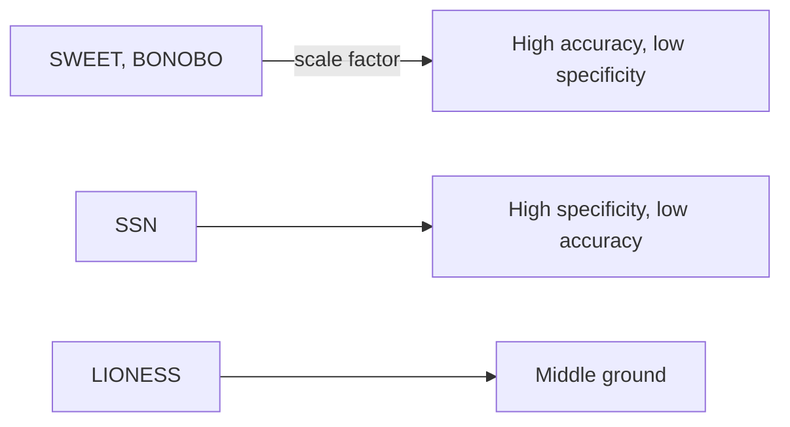
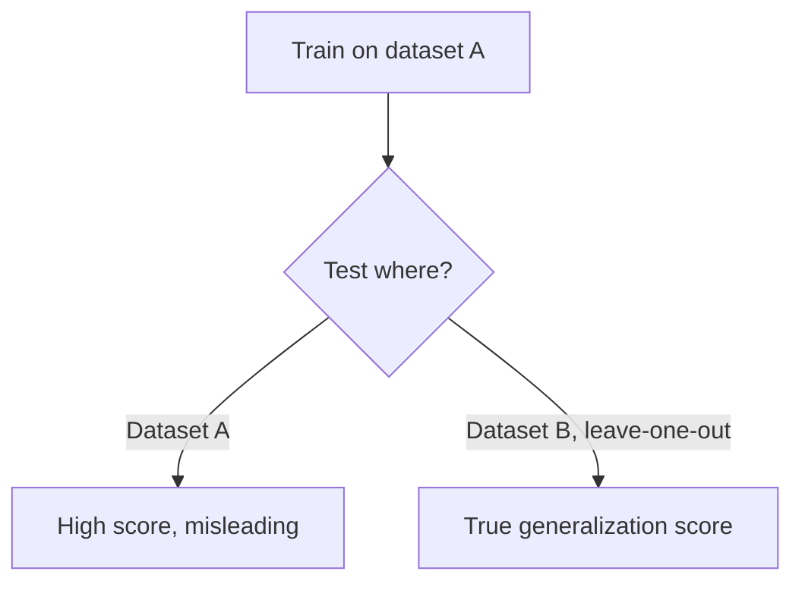

# Chapter 10: The limits of network prediction

## Contents
- [What is the limit this chapter is about?](#what-is-the-limit-this-chapter-is-about)
- [Why does it matter?](#why-does-it-matter)
- [How does it show up?](#how-does-it-show-up)
- [What this means for you](#what-this-means-for-you)
- [Sources](#sources)

## What is the limit this chapter is about?

Every method in the previous two chapters turns network structure into a prediction. This chapter is about where that move gets shaky: when the method's own assumptions quietly decide the answer, when a promising idea has no public paper to check, when a model trained on one dataset collapses on another, and when the right representation for a piece of biology is not a prediction at all but a category. Four talks, four different ways graph-based prediction can mislead you if you take its output at face value.

## Why does it matter?

A prediction is only as trustworthy as the assumptions baked into the method that produced it. Those assumptions are usually invisible: buried in a scaling factor, a choice of training data, a choice of test split. If you cannot see the assumption, you cannot judge whether the prediction it produced applies to your situation. That is the through-line connecting a graph-comparison audit, an unpublished tool, a cross-dataset benchmark, and a variant-representation standard: each one is fundamentally about exposing what a method is quietly assuming before you trust its output.

## How does it show up?

### Single-sample network modeling: the hidden knob behind every method's headline number

A biological network built from many pooled samples averages away person-to-person differences. Single-sample network methods fix that by estimating the network for one individual, but each method (SWEET, BONOBO, SSN, LIONESS) was published in its own notation, which made them impossible to compare honestly (Session: "Challenges and opportunities in single-sample network modeling", Kimberly Glass, NetBio).

Glass re-casts all four methods in one shared mathematical notation and finds the hidden knob directly: SWEET and BONOBO both include a scale factor that pulls each sample's predicted network toward a shared background network. That factor buys high accuracy, because it anchors every prediction near a sensible average, but it costs specificity, meaning the predicted networks end up looking similar across different samples, which defeats the point of single-sample modeling. SSN sits at the opposite extreme: most specific, least accurate. LIONESS lands in between, nearly as accurate as SWEET and BONOBO and nearly as specific as SSN.

No method here is simply "best." Each trades accuracy for specificity through an assumption you would never see by reading the reported score alone. The opportunity Glass names, a common framework that could combine their strengths deliberately, only exists because the comparison exposed the trade-off in the first place.

### GIMME: fusing text and graph structure still needs a paper to exist

GIMME (Session: "GIMME: graph inference for microbial metabolism exploration", Winston Anthony, BOKR) is architecturally the most on-target talk in this whole part: it fuses pretrained language representations of free-text experiment metadata with relational message passing over a biological graph, a graph neural network reasoning over a knowledge graph, to predict microbial gene fitness across conditions, with a natural-language query interface for evidence retrieval on top. That is close to the exact stack an agentic biomedical search system would want.

The limit is blunt: no public paper or preprint was located under this title and these authors, despite a direct search. Adjacent tools exist (IFIM, MetagenomicKG, KG-Microbe), but none of them is GIMME. Until a paper surfaces, every specific claim about GIMME's performance is unverifiable, and the architecture, however promising, should be read as a design pattern to study, not a result to cite.

### Transfer learning for ASD: in-distribution scores lie

This talk (Session: "Transfer learning for detecting Autism Spectrum Disorder using AutDB", Ruslan Kurmashev, MLCSB) is a benchmark, not a network-prediction method, but it belongs here because it names the failure mode that undermines every prediction system in this part if you skip it: a model can score high when tested on the same dataset it trained on, then collapse on a different one.

The team harmonizes two datasets, MMASD and Engagnition, built from body-pose tracking and motion sensors, into one shared metadata table with a common proxy activity label. They compare two simple models (logistic regression and XGBoost) two ways: trained and tested within one dataset, and trained on one dataset but tested on the other, called leave-one-dataset-out. They measure how far apart the two datasets actually are using Wasserstein distance, a mathematical measure of distributional difference, and visualize it with UMAP. Standard domain-adaptation fixes only partly help: basic covariance alignment (CORAL) recovers some cross-dataset performance, while naive importance weighting is unstable.

No public paper was located for this specific benchmark either. What is confirmed is the design, and the design is the point: an honest evaluation tests on a source the model never trained on, and it reports what the model loses when it moves, rather than only what it achieves at home.

### Cat-VRS: when the right structure is a category, not a prediction

Cat-VRS (Session: "Cat-VRS: scalable representation of categorical genomic variation", Daniel Puthawala, BOKR) is the deliberate outlier in this chapter, and in this whole part. It does not predict anything. It is a representation standard from the Global Alliance for Genomics and Health (GA4GH) for describing categories of genetic variants, such as "activating mutations" or "gene fusions," rather than one exact variant at a time.

Clinical knowledge constantly refers to a whole class of variants defined by a shared property, but existing standards were built to describe one precise variant well, not a category. Cat-VRS closes that gap with a constraint-based model: instead of enumerating every member of a category, you define it by the properties its members must satisfy, built from modular, composable constraints. New constraint types, Function and Adjacency, extend the model to functional variants, rearrangements, and gene fusions, alongside the existing Defining Allele, Defining Location, Copy Count and Change, and Feature Context constraints. It is implemented in real clinical resources, VICC MetaKB and CIViC, across graph, relational, and flat-file databases, with a v1.0.0 release (June 2025) and 12 registered implementations. The scale of the problem it addresses is concrete: 83 of 236 precision oncology FDA approvals (35.17 percent) referenced broad variant categories, not single exact variants.

The reason it belongs in a chapter about limits: it is a reminder that not every biological question is a prediction problem. Sometimes the right computational move is not to infer a missing relationship from a graph, it is to build a representation precise enough that matching becomes a lookup instead of a guess. A well-designed category is a form of structure that makes prediction unnecessary for the cases it covers.

## What this means for you

This chapter is the check on the previous two. Before trusting a graph-based prediction inside agentic search v4, or reporting one to a user, ask the four questions this chapter raises in order.

First, what hidden assumption is baked into the method, and can you name it the way Glass named the SWEET and BONOBO scale factor? If you cannot, do not trust the headline accuracy number at face value.

Second, does a citable paper actually exist for this method, or only a conference abstract? GIMME is the caution here: an architecture can be exactly right and still be unverifiable until the paper shows up. Treat "talk description only" claims as leads to verify, not facts to cite.

Third, was the method evaluated on a source it never trained on? The ASD transfer-learning talk is the general case of the evaluation discipline this whole part depends on: in-distribution performance is the easiest number to inflate and the least useful one to report.

Fourth, is this actually a prediction problem, or is it a representation problem in disguise? Cat-VRS's answer, define the category precisely and let matching do the work, is often cheaper and more trustworthy than training a model to infer membership. When agentic search v4 needs to match an entity to a broader class, ask whether a composable-constraint definition beats a learned classifier before reaching for the graph-prediction machinery in chapters 8 and 9.

## Sources

| Session | Time | Paper status |
|---------|------|---------------|
| Cat-VRS: scalable representation of categorical genomic variation | 12:00-12:20 | Paper verified |
| GIMME: graph inference for microbial metabolism exploration | 15:40-16:00 | No public paper found (verified) |
| Transfer learning for detecting Autism Spectrum Disorder using AutDB | 12:10-12:20 | No public paper found (verified) |
| Challenges and opportunities in single-sample network modeling | 15:50-16:00 | Paper verified |
