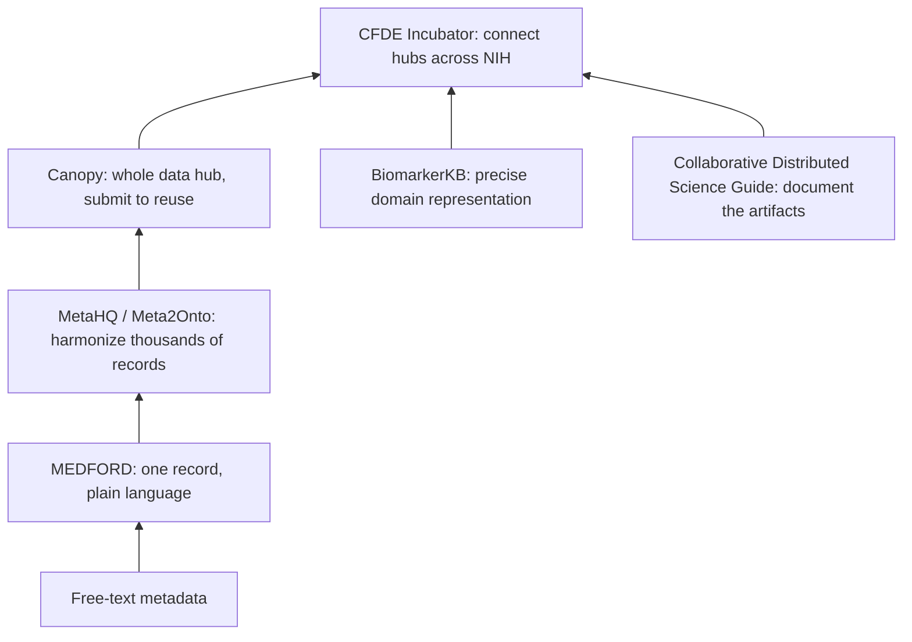

# Chapter 11: FAIR data infrastructure and metadata standards

## Contents

- [What is FAIR data infrastructure?](#what-is-fair-data-infrastructure)
- [Why does it exist?](#why-does-it-exist)
- [How does it work?](#how-does-it-work)
- [What this means for you](#what-this-means-for-you)
- [Sources](#sources)

## What is FAIR data infrastructure?

FAIR means data that is Findable, Accessible, Interoperable, and Reusable. It is a set of principles, not a piece of software. The six talks in this chapter are what happens when different teams each build the actual plumbing that turns that principle into something you can run.

Think of it as a stack. At the bottom, someone has to write down what a dataset actually is, in a form a machine can parse. One layer up, someone has to make thousands of those descriptions say the same thing the same way. Above that, someone has to package the whole submit-validate-discover cycle as reusable software instead of one-off engineering. And at the top, someone has to get separate institutions to agree on shared identifiers so their data hubs can talk to each other at all. This chapter walks the stack bottom to top.

## Why does it exist?

Every research consortium hits the same wall. A dataset arrives with metadata that is either missing, wrong, or written in free text that means something different to every reader. Writing good metadata usually requires programming skill or filling out a rigid form, so people skip it or do it badly. That single failure cascades: search cannot find the data, harmonization across studies breaks, and any AI system built on top inherits noisy, ungrounded input.

The problem shows up at every scale. A single dataset needs a metadata record (Session: "MEDFORD in a box: improvements and future directions for a metadata description language", Noah Daniels, Lincoln West). A repository of 270,000 gene expression studies needs harmonized annotations across all of them (Session: "MetaHQ and Meta2Onto: standardized annotations of public transcriptomics data", Parker Hicks, Lincoln West). A consortium building a data hub from scratch re-solves access control and metadata capture every time (Session: "Canopy: an open-source platform for FAIR research data hubs", Marcos Martínez-Romero, Lincoln West). A distributed AI research team needs a shared vocabulary so its outputs are catalogable at all (Session: "Templated collaborative science resources for FAIR and reproducible AI research products", Hilmar Lapp, Lincoln West). NIH funds dozens of repositories that were each built in isolation and cannot yet interoperate (Session: "The Common Fund Data Ecosystem (CFDE) Incubator for Pan-NIH resources", Julie Jurgens, Broad Institute, Lincoln West). And a specific data type, biomarkers, needs a representation precise enough to support real reasoning, not just loose association (Session: "A FAIR framework for structured biomarker representation", Maria Kim, Lincoln West).

None of these are the same problem. They are the same problem at six different zoom levels.

## How does it work?

### Layer 1: writing one record

MEDFORD is a plain-text markup language for scientific metadata, built for people who are not programmers. MEDFORD-in-a-Box adds an updated parser that checks a record is well formed, a visual editor extension for live feedback while typing, and a macro syntax so a block of metadata you define once can be reused instead of retyped. The goal, in the project's own words, is metadata that is correct, consistent, and reusable, which is the precondition for reproducibility. The improvements also add BagIt export, a standard packaging format for transporting data.

### Layer 2: harmonizing thousands of records

MetaHQ and Meta2Onto tackle the same problem at the scale of public transcriptomics data. Repositories like GEO and SRA hold millions of samples described in inconsistent free text, so "liver" and "hepatic tissue" never resolve to the same concept unless someone forces them to. MetaHQ pulls hand-curated annotations from 13 separate sources and harmonizes them into one database covering tissue, disease, sex, and age for nearly 200,000 samples, with a reference back to each original source so a user can still cite it. Manual curation cannot keep pace with data growth, so Meta2Onto adds txt2onto, a lightweight, interpretable text model that predicts standardized tissue and disease terms directly from raw metadata for over 270,000 GEO studies. Interpretable here means the tool shows which words drove each prediction and how confident it is, so a user can decide whether to trust a machine-generated annotation the same way they would judge a human one.

### Layer 3: packaging the whole data hub

Canopy takes the same problem up one more level. Instead of harmonizing metadata within an existing repository, it packages the entire submit-validate-discover-reuse cycle as reusable open-source software, extracted from the production NIH RADx Data Hub. It enforces structured metadata with CEDAR templates (fill-in-the-blank forms that force every dataset to carry the same fields), links terms to controlled vocabularies from BioPortal so a concept maps to one shared identifier instead of free text, and uses a common data element framework, implemented as parameterizable operations with automated tracking, so harmonization decisions are recorded rather than lost. It has been stress-tested at NIH scale, close to 200 studies from over 100 organizations across four programs, and is released under a permissive open-source license.

### Layer 4: connecting the hubs

Even with well-built individual hubs, NIH-funded repositories were built in isolation and do not talk to each other. The Common Fund Data Ecosystem Incubator, held July 9 to 10, 2026 in Bethesda, gathered leaders of NIH-funded repositories and knowledgebases to find shared standards, shared embeddings (numeric vectors representing a gene or concept so different resources can align entities mathematically), and shared protocols. The CFDE this sits on top of is not small: as of March 2026 it integrates 18 NIH Common Fund programs, offering access to over 10 million files, 2.1 million biosamples, and 1.25 million knowledge graph assertions across 16 programs. The Incubator's job was to find the gaps blocking those programs from composing into one system and propose pilot projects to close them.

### A parallel track: documenting the artifacts, and one domain done precisely

Two more talks round out this layer. The Collaborative Distributed Science Guide gives distributed AI research teams a shared vocabulary and step-by-step workflow, version control, FAIR repositories on GitHub and Hugging Face, and templates for READMEs, model cards, and dataset cards. A model card is a short standard document describing what a model does, how it was trained, and its limits. A companion serverless catalog app pulls straight from the GitHub and Hugging Face APIs and only rewards products that follow the guide, which nudges a team toward FAIR without a mandate.

BiomarkerKB is what FAIR looks like applied precisely to one data type. Existing knowledge graphs record loose links like "gene X relates to disease Y" but miss the measurable change that actually defines a biomarker under the NIH-FDA definition. BiomarkerKB instead structures each biomarker around core fields (the entity, the condition, the exposure agent) plus contextual metadata (specimen, biomarker role, evidence, provenance), built on the Biolink data model and integrated with the Common Fund Data Ecosystem's own knowledge graph. In its initial release it holds over 300,000 nodes, 1.2 million edges, and more than 200,000 biomarker-disease associations, all queryable in Neo4j.

## What this means for you

The pattern repeats at every layer: normalize identifiers and structure at ingest time, not after the fact, and record provenance as a first-class field rather than an afterthought. That is true whether you are writing one MEDFORD record or building a cross-NIH registry. If a retrieval system pulls documents whose metadata is thin or inconsistent, both retrieval precision and citation quality suffer downstream, no matter how good the reasoning layer on top is.

The other transferable lesson is where AI genuinely helps versus where it just accelerates existing structure. Meta2Onto's interpretable, confidence-scored predictions are useful precisely because they are auditable, not because they replace curation. A prediction with no visible reasoning is not a shortcut, it is a new source of silent error. Any pipeline that structures free text at scale should carry the same discipline: show the evidence for the structure, not just the structure itself.

## Sources

| Session | Time | Paper status |
|---------|------|---------------|
| MEDFORD in a box: improvements and future directions for a metadata description language | 11:05-11:20 | Paper verified |
| MetaHQ and Meta2Onto: standardized annotations of public transcriptomics data | 11:05-11:20 | Paper verified |
| A FAIR framework for structured biomarker representation | 12:20-12:40 | Paper verified |
| Canopy: an open-source platform for FAIR research data hubs | 14:20-14:40 | Paper verified |
| Templated collaborative science resources for FAIR and reproducible AI research products | 14:40-15:00 | Paper verified |
| The Common Fund Data Ecosystem (CFDE) Incubator for Pan-NIH resources | 14:40-15:00 | Paper verified |
