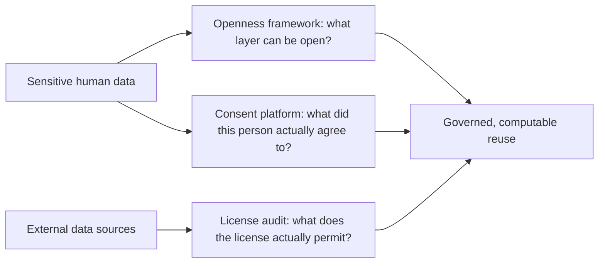

# Chapter 12: Consent, licensing, and sensitive data

## Contents

- [What is it?](#what-is-it)
- [Why does it exist?](#why-does-it-exist)
- [How does it work?](#how-does-it-work)
- [What this means for you](#what-this-means-for-you)
- [Sources](#sources)

## What is it?

FAIR data assumes reuse is the goal. But some data cannot simply be made open: a patient's genome, a participant's consent preferences, a dataset's legal terms of use. This chapter covers three talks that each encode a different kind of boundary into a computable, machine-readable form instead of leaving it buried in a PDF or a human memory. One gives a mental model for what "open" should even mean when data is sensitive. One builds the software that captures a person's actual consent choices and keeps them current. One audits whether the licenses attached to 39 real biomedical data sources actually permit the reuse everyone assumes is fine.

## Why does it exist?

A knowledge graph or an AI system that ingests biomedical data eventually touches something a person did not unconditionally agree to share, or something licensed under terms that quietly forbid the use it is being put to. Three different failure modes follow from ignoring this:

Ambiguity failure: without a shared framework, every consortium reinvents its own definition of "open enough," and reviewers, funders, and institutions cannot compare access policies across projects (Session: "As open as possible; as closed as necessary: rethinking data sharing frameworks in the genomic era", Mallory Freeberg, Lincoln West).

Consent-drift failure: a participant consents once at enrollment, then the world and the study both change, but paper consent forms cannot be updated, so either the data goes stale or the participant's actual current wishes get ignored (Session: "CTRL: a dynamic open source e-consent platform for genomic health research", Sarah Kummerfeld, Lincoln West).

License-blindness failure: an AI research pipeline pulls from dozens of data sources with different licenses, no one checks compatibility, and the resulting model or dataset inherits a legal landmine no one can see until it is a problem (Session: "Legal interoperability as infrastructure: a case study of the Biomedical Data Translator", Shilpa Sundar, Lincoln West).

## How does it work?

### A framework for what "open" even means

Freeberg's talk reframes openness as a stack with four separate layers, and argues each layer can be open or closed independently: the data itself, the standards used to describe it, the software used to process it, and the governance structures around it. A project can (and often should) keep raw data access-controlled while making its standards, its software, and its governance fully open. DECIPHER, a rare disease genomic data platform, and the European Genome-phenome Archive (EGA) are used as concrete case studies of this layered model in practice. The talk also points to the Federated EGA Network, a system where sensitive data never physically moves. Instead, approved analyses run inside each local, controlled environment and only aggregate, non-identifying results leave, which is a structural way to get research value out of data that legally or ethically cannot be centralized.

### Making consent itself dynamic and machine-readable

CTRL solves the opposite half of the same problem: once a governance layer decides data can be shared under certain conditions, how does the system know what conditions a specific person actually agreed to, today, not at enrollment three years ago? CTRL is an open-source e-consent platform with two portals, one for researchers managing a study's consent requirements and one for participants managing their own preferences. It integrates with a bioethics ontology so consent choices are recorded in a standardized, machine-actionable form, not free text, which means a downstream data access system can programmatically check "is this specific reuse covered by this specific person's current consent" instead of a human re-reading a form.

The honest complication, confirmed by an evaluation study of the platform, is that dynamic consent only works if people actually use it. In practice only about 15 percent of eligible participants registered on the platform at all, and most who did register logged in once, set preferences, and never revisited them, regardless of whether the study was run by a nonprofit or a commercial sponsor (nonprofit studies did see a notably higher opt-in rate near 80 percent, versus about 45 percent for commercial ones). Dynamic consent, as designed, assumes ongoing engagement. The evaluation data shows that assumption does not hold for most participants once the initial choice is made.

### Auditing whether licenses actually permit reuse

Sundar's talk takes the license layer of Freeberg's stack and stress-tests it against a real system: the Biomedical Data Translator, a federated knowledge graph reasoning platform that pulls from many independent data sources. The audit checked the licenses on all 39 of the Translator's data sources and found a genuinely mixed picture: 19 permissively licensed, 6 under ShareAlike terms (which require anything built using that data to be released under the same license, a condition that can "contaminate" a downstream product's licensing without anyone noticing), 12 under commercially restrictive terms, and 2 with no clear license status at all. This connects to an earlier, broader audit by the (Re)usable Data Project, which reviewed 56 biomedical resources and found similarly uneven licensing practices across the field. The takeaway is not that the Translator did something wrong. It is that legal interoperability has to be actively audited, the same way technical interoperability is, because licensing incompatibility is invisible until an actual downstream use triggers it.

## What this means for you

Any provenance record worth keeping needs three additional computable fields, not just source and timestamp: consent status, license terms, and the population or context the data came from. These three, per this chapter, are exactly the fields that quietly fail when left as prose in a PDF instead of structured metadata. This is also where the `ai-security-standards` rule's restricted-data-category list (PII, PHI, dbGaP controlled access data) stops being an abstract compliance requirement and becomes a concrete design decision: which layer of a system is allowed to touch which data, and can the system prove it programmatically rather than by policy memo.

The CTRL evaluation data is worth sitting with a moment longer. Building the machine-readable capability to check consent dynamically does not by itself produce dynamic consent, because most participants will not return to update preferences after their first visit. A consent platform's real design problem is not the ontology integration, it is getting a busy person to come back.

## Sources

| Session | Time | Paper status |
|---------|------|---------------|
| As open as possible; as closed as necessary: rethinking data sharing frameworks in the genomic era | 15:00-15:20 | Paper verified |
| CTRL: a dynamic open source e-consent platform for genomic health research | 15:00-15:20 | Paper verified |
| Legal interoperability as infrastructure: a case study of the Biomedical Data Translator | 15:00-15:20 | Paper verified |
