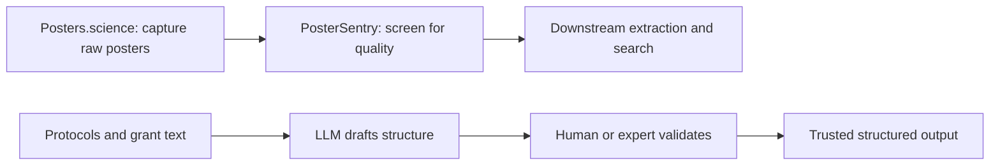

# Chapter 13: AI in the curation and quality pipeline

## Contents

- [What is it?](#what-is-it)
- [Why does it exist?](#why-does-it-exist)
- [How does it work?](#how-does-it-work)
- [What this means for you](#what-this-means-for-you)
- [Sources](#sources)

## What is it?

Five talks, one underlying question: where in a real curation or compliance pipeline does AI genuinely save time, and where does it need a human, or a cheap secondary check, standing between it and production. The five talks trace an actual pipeline shape: raw material gets captured (poster scraping), screened for quality before anything expensive happens to it (a lightweight classifier), then AI attempts structured extraction or drafting on top of it (compliance documents, protocol structures), with a human validation layer framing the whole thing as a defined professional skill, not an afterthought bolted on at the end.

## Why does it exist?

Curators cannot keep up with literature growth by hand (Session: "The critical role of human validation in the era of AI-assisted biocuration", Patricia Carvajal-López, Lincoln West). Grant compliance writing, specifically data management plans, is a slow, repetitive bottleneck that AI looks well suited to draft (Session: "Evaluating the performance of LLMs in drafting data management plans", Nahid Zeinali, Lincoln West). Highly specialized extraction tasks, like pulling structured protocol details out of a sequencing library prep description, look automatable on the surface but turn out to expose a real gap between memorization and genuine comprehension (Session: "Toward domain-specific genomic AI agents: an evaluation of LLM understanding of sequencing library structures", Chi-Lam Poon, Lincoln West). Before any of that AI processing happens, someone has to capture the raw material, in this case scientific posters, in a structured form at all (Session: "Posters.science: building open infrastructure for poster metadata and content", Bhavesh Patel, Lincoln West). And once that raw material exists, a lot of it is low quality or off-topic, so a cheap upfront filter matters more than a sophisticated downstream model (Session: "PosterSentry: a lightweight classifier for scientific poster quality screening", James O'Neill, Lincoln West).

## How does it work?

### Capturing the raw material

Posters.science is the layer everything else in this chapter depends on. Conference posters are a huge, mostly invisible body of scientific output, usually a PDF that gets presented once and then disappears. The project builds open infrastructure to change that: an LLM-driven pipeline extracts a structured poster.json record from each poster PDF (title, authors, abstract, key findings, methods), and a separate step canonicalizes author affiliations against ROR, the Research Organization Registry, so "MIT," "Massachusetts Institute of Technology," and a department-level address all resolve to the same institution identifier. The registry already holds more than 1,500 posters. Without this capture step, none of the later screening or extraction work in this chapter has anything to run on.

### Screening before anything expensive happens

PosterSentry sits right after capture. Not every captured poster is worth running through an expensive downstream pipeline, some are low quality, off-topic, or malformed. Instead of using a large model to make that call, PosterSentry uses a tiny logistic regression classifier, about 10 kilobytes, trained on structural and content features rather than deep semantic understanding, and reaches 87.3 percent accuracy on the quality-screening task. The point of the talk is not that a tiny classifier beats a large model on raw capability, it does not, but that it is cheap enough to run on every single item before anything expensive touches it. A guardrail only works if it is cheap enough to actually put in front of everything.

### Drafting compliance documents, and where it falls short

Zeinali's talk moves from screening to generation: can an LLM draft a data management plan, the compliance document every NIH grant now requires, well enough to save a researcher real time. The evaluation compared GPT-4 against Llama 3.3, an openly available model, using a structured drafting pipeline called DMP Chef and expert human scoring of the outputs against NIH requirements. GPT-4 outperformed the open model by a meaningful margin, which matters because it means the choice of underlying model is not incidental to whether this kind of drafting assistance is actually usable, a weaker open model produced a weaker draft that needed more human rework to reach compliance.

### Where extraction genuinely fails: memorization versus comprehension

Poon's talk is the sharpest cautionary result in this chapter. It tests nine frontier language models against 13 ground-truth sequencing library structures drawn from a real reference resource (scg_lib_structs), measuring how accurately each model can extract the correct structural components of a library preparation protocol, scored with Levenshtein similarity, a string-distance metric. Scores landed around 0.80 to 0.84, which sounds respectable until the pattern underneath it is examined: models performed noticeably better on well-known, widely documented commercial kits (the kind of protocol that appears verbatim across thousands of papers and forum posts a model was trained on) than on less common academic protocols that require actually reasoning through the structure rather than recalling a memorized description. A model that scores well on a familiar protocol and poorly on an unfamiliar one of the same type is demonstrating retrieval of training data, not domain understanding, and a pipeline that cannot tell the two apart will silently degrade the moment it meets a protocol outside the model's training distribution.

### Naming the human role explicitly

Carvajal-López's talk is the frame that ties the other four together. Roughly 100 to 200 professional biocurators exist worldwide, facing literature growth that has long outpaced what manual curation alone can cover. The talk extends a formal competency framework from the International Society for Computational Biology to explicitly include AI literacy as a curator skill, not a replacement for curation. It cites concrete evidence for where the human-in-the-loop model already works at scale: InterPro has over 3,000 LLM-generated protein family descriptions in production, and GOFlowLLM reaches an 86.7 percent agreement rate between AI-extracted annotations and expert curators on Gene Ontology extraction tasks. The framing throughout is that AI handles the routine, high-volume first pass, and curators retain critical evaluation and domain judgment, which is a job description, not a stopgap.

## What this means for you

Read across all five talks and the same shape recurs: AI produces a strong first draft or a fast first pass, and a validation step, whether that is a trained human curator, a cheap upfront classifier, or an expert scoring rubric, decides whether that draft ships. The Poon result is the one to sit with longest, because it shows this gate matters even for tasks that look purely mechanical. Structured extraction from a well-known protocol type can look reliable in aggregate while quietly failing on exactly the inputs a real system will eventually see, unfamiliar, poorly documented, or genuinely novel ones. This is the same discipline the `nws-production-standards` cite-or-refuse gate encodes for AI answer generation: a confident-looking output is not evidence of a correct one, and the gap only shows up when you test the edge, not the average case.

## Sources

| Session | Time | Paper status |
|---------|------|---------------|
| The critical role of human validation in the era of AI-assisted biocuration | 15:00-15:20 | Paper verified |
| Evaluating the performance of LLMs in drafting data management plans | 15:20-15:40 | No public paper found (verified) |
| Toward domain-specific genomic AI agents: an evaluation of LLM understanding of sequencing library structures | 15:20-15:40 | No public paper found (verified) |
| PosterSentry: a lightweight classifier for scientific poster quality screening | 15:20-15:40 | Paper verified |
| Posters.science: building open infrastructure for poster metadata and content | 14:40-15:00 | Paper verified |
