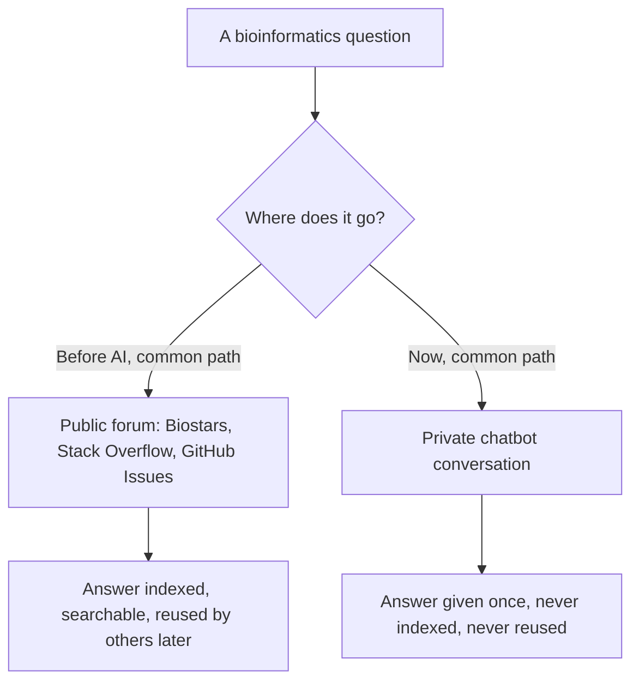

# Chapter 14: The closing culture debate

## Contents

- [What is it?](#what-is-it)
- [Why does it exist?](#why-does-it-exist)
- [How does it work?](#how-does-it-work)
- [What this means for you](#what-this-means-for-you)
- [Sources](#sources)

## What is it?

The BOSC track's final block was not another tool talk. It was three sessions asking what happens to open-source bioinformatics culture itself once AI assistants become part of how people write documentation, ask questions, and solve problems day to day. One talk shows AI genuinely strengthening an open training resource. One talk argues AI chatbots are quietly hollowing out the public spaces that used to teach people bioinformatics for free. The closing panel puts both arguments in the same room.

## Why does it exist?

Every other chapter in this Part is about making data and workflows more open and more trustworthy. This chapter is about whether the culture that produces open, trustworthy science can survive contact with the tools built to help it. Training materials need constant maintenance and translation, a genuinely hard, unglamorous, ongoing task (Session: "Using AI to develop, maintain, and translate bioinformatics training materials", Geraldine Van der Auwera, Lincoln West). At the same time, the venues where people used to ask "how do I do this" in public, and get an answer other people could later find and learn from, are being replaced by private one-on-one chatbot conversations that leave no public trace (Session: "Learning in public, losing in private?", Van Quynh Truong, Lincoln West). And the field's leaders were asked to debate what all of this means for open source specifically, not open science in general (Session: "Open source in the age of AI", panel discussion, Lincoln West).

## How does it work?

### The optimistic case: AI as a maintenance force multiplier

The Nextflow training project, hosted at nextflow-io/training, treats AI as infrastructure for a specific, chronic maintenance problem: keeping a large body of technical training material accurate and available in multiple languages as the underlying software keeps changing. It defines reusable "skills," in effect standing prompt templates encoding how a specific kind of edit should be made, so a maintainer does not have to re-explain house style and technical constraints every time. Code examples inside the material are validated by actually running them in containers before merging, so an AI-suggested edit cannot silently introduce a broken example. For translation specifically, the project adopted a deliberate discipline: when a translated version reads wrong, the fix is to correct the prompt that generates that class of translation, not to hand-patch the one broken output. That keeps the fix reproducible across the whole document set instead of being a one-off patch that will need repeating the next time the source material changes. The material is maintained in ten languages under this model.

### The pessimistic case: what gets lost when help moves private

Truong's talk argues that public technical forums, Biostars, Stack Overflow, GitHub Issues, were never just Q&A archives. They did five things at once that a private chatbot conversation cannot replicate: ambient mentorship (a newcomer absorbs norms by watching how questions get answered, not just reading the answer), peer validation (other experts can correct a wrong answer in public, so bad advice gets caught), collective memory (the same question, answered once, helps everyone who searches it later, not just the original asker), granular resource authority (a well-answered thread becomes a trusted reference people link to), and decentralized tool control (no single company mediates who can ask or answer). When help moves into a private chatbot session, none of these five survive: the exchange is not searchable, not peer-reviewed, not reusable, and mediated entirely by whichever company runs the assistant.

The talk names a sharper risk than "old habits fading": liability without ownership. An AI assistant can generate a plausible, wrong technical answer, and unlike a wrong answer on a public forum, no other expert is positioned to publicly correct it before the asker acts on it. The talk proposes five counters, largely mirror images of what was lost: deliberately capturing and publishing useful AI-assisted exchanges, building peer review back into AI-assisted workflows, and preserving public spaces as the default rather than the fallback.

### The debate: what open source specifically owes

The closing panel drew four named panelists, Aida Miro-Herrans, Nahid Zeinali, Alex Bateman, and Eric Green, moderated by Jason Williams. Its stated scope was narrower and sharper than "AI and open science" in general: what does open source specifically owe when an AI agent can now write, propose, or even merge code into a shared project. The BOSC program frames the debate around four concrete tensions: how much of a contribution an AI can make before attribution becomes murky, who is accountable when an AI-authored pull request introduces a scientific error, whether AI-assisted contributions threaten or strengthen a project's long-term sustainability, and whether existing code-review norms are enough to catch AI-introduced mistakes before they ship. As a panel discussion, it has no accompanying paper, deliberately: this was convened as an open debate, not a study with a result to report.

## What this means for you

Put next to each other, these three sessions are not a contradiction, they are the same shift viewed from two vantage points plus a live argument about what to do about it. The Nextflow project shows AI can strengthen an open resource when the fix targets the reproducible cause (the prompt, the template) rather than patching the symptom. Truong's talk shows the same technology quietly draining the public commons that made open-source bioinformatics culture self-teaching in the first place, not through malice, just through convenience: a private answer is faster to get than a public one, even when it is worse for everyone else.

For anyone building an AI system that touches open science, including agentic search v4, the practical takeaway is to treat "does this interaction leave a public, reusable trace" as a design question, not an afterthought. A system that answers a question and discards the exchange is optimizing for the asker's five minutes at the cost of the next person's search. The "fix the prompt, not the output" discipline from the training-materials talk is also directly reusable: any correction to an AI-assisted process should target the reproducible cause of the error, not the one instance of it, or the same error just resurfaces at the next release.

## Sources

| Session | Time | Paper status |
|---------|------|---------------|
| Using AI to develop, maintain, and translate bioinformatics training materials | 15:40-15:50 | Paper verified |
| Learning in public, losing in private? | 15:50-16:00 | No public paper found (verified) |
| Open source in the age of AI | 16:40-17:40 | No public paper found (verified) |
