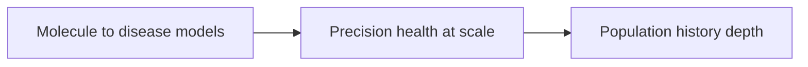

# Chapter 15: The keynote arc

Three distinguished keynotes opened Monday, Tuesday, and Wednesday of ISMB 2026. Read back to back, they trace one continuous zoom: from the molecular wiring inside a single cell, out to a health system trying to serve everyone equally, out further to the deep demographic history that shaped every genome in the room. Each speaker answered a different question, but the three questions turn out to be one question asked at three different scales: what can we predict, who can we predict it for, and how did the population we are predicting for come to exist.

## Contents

- [What is the keynote arc?](#what-is-the-keynote-arc)
- [Why does it exist?](#why-does-it-exist)
- [How does it work?](#how-does-it-work)
- [What this means for you](#what-this-means-for-you)
- [Sources](#sources)

## What is the keynote arc?

The three talks, in the order they were given:

- Olga Troyanskaya (Monday): models that connect DNA sequence, gene regulation, molecular networks, and clinical outcomes into one predictive picture of disease.
- Carlos Bustamante (Tuesday): the infrastructure and equity work needed to make precision health work for populations that current genomic medicine underserves.
- Partha Majumder (Wednesday): a genome-scale reconstruction of how India's population history shapes disease risk and drug response today.

None of the three talks cites the other two. But sequencing them across three days builds an argument by accident: a predictive model is only as good as the population it was trained on, and that population carries a history which determines who the model actually works for.

## Why does it exist?

Precision medicine has a scaling problem hiding inside its own name. Precision implies the model is precise for you, specifically, not for a demographic average. But most of the training data underlying genomic medicine comes from a narrow slice of humanity, chiefly people of European ancestry, so the precision many tools deliver is precise for that slice and unreliable for everyone else. Closing that gap needs three separate things, working together. First, a model good enough to predict disease mechanisms at all, which is Troyanskaya's talk. Second, infrastructure that actually captures data from the populations genomic medicine has historically left out, which is Bustamante's talk. Third, a way to formally account for the deep, non-random structure hiding inside any human population, structure that changes how a genetic association should be read in the first place, which is Majumder's talk. Skip any one of the three and the other two stay incomplete: a precise model trained on the wrong population is still wrong, and a well-sampled population whose internal structure nobody accounted for still misleads.

## How does it work?

### Predictive models of human biology and disease

Troyanskaya's keynote presented a stack of model families, each aimed at a different scale of biology, chained together into one picture. At the bottom, models read a genetic variant and predict its biochemical and regulatory effect, so a mutation is understood as a mechanism, not just a coordinate on a chromosome. Above that, network-aware models simulate how a perturbation, such as knocking out a gene, ripples through cellular circuits in software rather than in a wet lab. Above that again, genetics-informed phenotype models link those molecular programs to disease subtypes and clinical trajectories. The headline model from her lab, named Mahi, integrates chromatin accessibility, transcription factor binding, histone modifications, and protein structure features across 290 tissues and cell types, and it was validated by predicting gene essentiality across 1,183 cancer cell lines, beating sequence-only models at that task.

The talk's closing line was the one that mattered most for the rest of the conference: the next frontier is pairing these predictive models with verifiable, agentic AI systems that reason over biological evidence, propose and test hypotheses, and keep that reasoning transparent and reproducible. A distinguished keynote naming agentic, verifiable AI as the field's stated destination, on day one, set the tone every later agentic talk built on.

### Precision health at scale for all

Bustamante's keynote named the actual bottleneck behind precision medicine's equity gap: most reference genomic data was never collected from most of the world. The Galatea Bio biobank he described was built specifically to correct that. At founding, under 1 percent of global biobank samples came from people of Latin American ancestry, against roughly 90 percent from European ancestry. Galatea Bio is a CAP-accredited biobank sized for 10 million DNA samples, holding about 500,000 today with a projected 1 million by year end, sequenced on Illumina NovaSeq 6000 and NextSeq 2000 platforms and paired with AI and machine learning models over clinical, genomic, and epidemiological data.

The concrete example that made the equity gap tangible: Puerto Ricans have the highest asthma rates in the Americas, but the lowest response to albuterol, a first-line asthma medication. That is not a coincidence of biology in the abstract. It is a genetic ancestry effect on drug response that a narrow, European-ancestry reference dataset would never have surfaced, because the people affected were never in the dataset to begin with. Bustamante's frame for fixing this: build large genomic resources that deliberately sample diverse ancestries, pair them with genotype-to-phenotype discovery methods, and connect academia, healthcare, industry, and government so a learning health system, one that improves as it accumulates patient data over years rather than snapshots, actually has data to learn from.

### Uncovering the palimpsest of India's population history

Majumder's keynote is a genome-scale demonstration of why population structure is not a footnote to a genetic finding, it is part of the finding. India has roughly 400 tribal groups and more than 4,000 caste and subcaste groups, the great majority of them endogamous, meaning people marry within the group. That structure hides an enormous amount of genetic history, and you cannot read it off a single population or a single gene.

A palimpsest is a manuscript that has been scraped and rewritten many times, where older text still shows faintly through the newer layer. The genome works the same way: each migration and admixture event leaves a faint trace underneath the next. Majumder's group's foundational analysis, published in PNAS in 2016, resolved mainland India into four distinct ancestral components, not the two that earlier work had inferred, plus a fifth component specific to the Andaman and Nicobar Islands that is likely ancestral to Oceanic populations as well. The same analysis dated a sharp shift from wide admixture to strict endogamy to roughly 70 generations ago, concentrated among Indo-European-speaking upper castes. Once that structure exists, it is not just history. It is present-tense clinical signal: disease susceptibility and drug response differ measurably by ancestry, the same way Bustamante's Puerto Rican asthma example plays out on a different population.

## What this means for you

Read together, these three keynotes make a case that is easy to miss when the talks are read in isolation. A model can be architecturally excellent, like Mahi, and still fail a population it was never trained to represent. A biobank can be well designed, like Galatea Bio, and still take years to correct decades of skewed collection. And a population's genetic structure, like India's caste and tribal endogamy, can sit invisible under a genomic finding for years before anyone accounts for it. None of these is a problem you fix once. They are three separate, ongoing disciplines, model-building, infrastructure-building, and population-structure accounting, and precision medicine only works when all three keep running at once. If you are building or evaluating a biomedical AI system, the practical habit this arc argues for is simple: treat the population a claim was measured in as part of the claim itself, not a footnote you can drop.

## Sources

| Session | Time | Paper status |
|---------|------|---------------|
| Keynote: toward predictive models of human biology and disease (Olga Troyanskaya) | 09:00-10:00, Monday | Paper verified |
| Keynote: Enabling precision health at scale for all (Carlos D. Bustamante) | 09:00-10:00, Tuesday | Paper verified |
| Keynote: Uncovering the palimpsest of India's population history (Partha P. Majumder) | 09:00-10:00, Wednesday | Paper verified |
