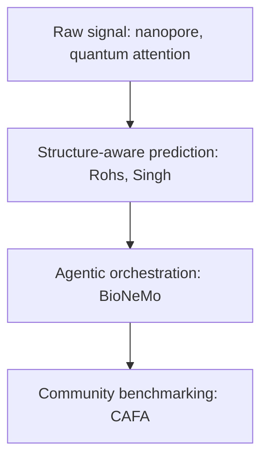
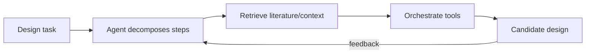

# Chapter 16: Methods and infrastructure

Thursday of ISMB 2026 was the conference's methods day, six talks spanning graph machine learning, agentic drug design infrastructure, DNA sequencing chemistry, a quantum computing experiment, structural biology, and a community benchmarking challenge run out of the American Great Plains. On paper these look like six unrelated topics. In practice they are six layers of the same stack, each solving a different piece of the problem of turning raw biological signal into a trustworthy, machine-usable prediction.

## Contents

- [What is the methods and infrastructure layer?](#what-is-the-methods-and-infrastructure-layer)
- [Why does it exist?](#why-does-it-exist)
- [How does it work?](#how-does-it-work)
- [What this means for you](#what-this-means-for-you)
- [Sources](#sources)

## What is the methods and infrastructure layer?

Every talk in this chapter answers a version of the same question: how do you get from noisy, high-dimensional biological data to a claim you can act on. The six talks split into two groups.

Foundational methods, which decide what a model is allowed to represent in the first place:
- Ritambhara Singh, graph machine learning for biomedicine, on treating 3D genome structure and molecular relationships as a graph rather than a flat sequence.
- Mauricio Lisboa Perez, nanopore sequencing of non-canonical bases, on extracting a new class of signal from raw sequencing electrical current.
- Kahn Rhrissorrakrai, quantum-enhanced attention for histopathology, on using a physically different computing substrate to reshape what an attention mechanism can learn.
- Remo Rohs, integrating genomics and structural biology, on predicting 3D shape and protein-DNA binding mechanics directly from sequence.

Infrastructure and field-building, which decide how those methods get deployed and evaluated at scale:
- Angel Pizarro and Kyle Tretina, BioNeMo, on an agentic workflow layer that chains prediction tools together without a human running each step.
- Iddo Friedberg, bioinformatics in the Great Plains, on CAFA, the multi-decade community benchmark that forces every new protein-function method to prove itself against the same held-out truth.

## Why does it exist?

A prediction is only useful if three things are true about it: it is built on a representation that actually captures the structure of the biology, it is generated efficiently enough to run at scale, and it can be checked against ground truth by someone other than the person who built it. The four method talks each attack the first condition from a different angle, sequence, structure, spatial genome organization, and even a different computing substrate entirely. BioNeMo attacks the second condition, since a design-test-learn loop that a human has to babysit at every step does not scale to the volume of candidates modern drug discovery needs to screen. CAFA attacks the third condition directly, and its multi-round history is a working answer to what open science demands elsewhere in this book: a benchmark run the same way for over a decade, with results held to the same held-out standard every round, is what makes a method's improvement claim credible instead of self-reported.

## How does it work?

### From learning to leveraging graphs in biomedicine

Singh's talk was framed as a survey of a field transition: biomedicine has spent a decade learning how to build graph neural networks, and the frontier question now is how to leverage that capability on problems flat sequence models cannot touch. The concrete example behind the framing is her lab's work on 3D genome organization. A model called GC-MERGE encodes Hi-C data, a technique that measures which distant regions of a chromosome physically fold close to each other, as a graph, and combines that spatial structure with local histone-modification signals to predict gene expression. A sequence-only model has no way to represent the fact that two genes far apart on a linear chromosome sit next to each other in 3D space and regulate each other because of it. A graph does. That is the general argument the talk makes: any time biology's real structure is relational rather than linear, a graph is the more honest representation, and the field is now mature enough to build on that instead of proving it works from scratch.

### Building AI scientist workflows with BioNeMo

The BioNeMo workshop demonstrated an agentic pipeline for biologics design, where a large language model agent decomposes a design task into steps, retrieves relevant literature and database context, and orchestrates structure prediction, molecular simulation, and binding affinity estimation tools in sequence, without a human approving each intermediate step. The closest verified example is a system built for designing biologics against intrinsically disordered proteins, proteins that lack a stable 3D structure and are therefore hard for structure-based tools like AlphaFold or RFdiffusion to handle in the first place. That is a harder case than a standard binder-design pipeline, and using it as the workshop's demonstration example makes a point about generality: if the agentic loop holds up on a target class the underlying structure-prediction tools were not built for, it is likely to hold up on the easier cases too.

### Enabling direct nanopore sequencing of non-canonical bases

Standard DNA sequencing reads the four canonical bases, A, C, G, and T. A growing body of biology, chemically modified bases, damaged DNA, synthetic biology constructs, lives outside that alphabet, and standard basecallers are not trained to recognize it. Perez's talk described a bootstrapped learning method for teaching a nanopore basecaller to read non-canonical bases directly from the raw electrical signal a nanopore device produces as a DNA strand passes through it, using signal splicing to build synthetic training examples rather than requiring bulk quantities of the modified molecule. The team sequenced 1,024 synthetic oligonucleotides at over 90 percent purity, generating more than 2.3 million reads per flowcell, and the non-canonical base signals showed a median fold-change above 6x relative to controls, detected at over 80 percent accuracy and 99 percent specificity. The method turns a sequencing platform's raw physical signal into a new class of readable data, which is the same move, at the chemistry layer, that a graph representation makes at the data-structure layer: extracting signal a simpler method would have thrown away.

### Quantum-enhanced attention for expression prediction from histopathology

Attention, the mechanism inside a transformer that decides which parts of an input to weight when making a prediction, is normally computed with a softmax function on classical hardware. Rhrissorrakrai's talk described QDSFormer, a method that replaces that softmax step with a variational quantum circuit, producing what is called a doubly stochastic attention matrix, meaning every row and every column of the attention weights sums to one. That constraint is not achievable exactly with a standard softmax, and the paper behind the talk shows the quantum-computed version outperforms standard vision transformers and other doubly-stochastic-attention variants on image recognition benchmarks, with the largest gains showing up specifically in the data-scarce regime, when there is not much training data to work with. Applied to histopathology, predicting gene expression patterns from a tissue image, that is directly relevant, because biomedical imaging datasets are almost always smaller than the natural-image datasets deep learning was built for. This is the only talk in the chapter that changes the computing substrate itself rather than the representation running on top of it, and it is included here as an early, narrow signal rather than a mature method: it works on small benchmark datasets today, not yet on production-scale histopathology cohorts.

### Integrating genomics and structural biology

Rohs's talk connected two methods that both predict something a wet-lab structural experiment would otherwise need to measure directly. Deep DNAshape predicts the 3D shape of a DNA molecule from its sequence alone, considering flanking sequence context of up to seven base pairs on each side, trained on a limited set of molecular simulation data rather than requiring a fresh simulation for every new sequence, which is where its throughput gain comes from. DeepPBS is a bipartite geometric graph neural network, meaning it represents a protein-DNA complex as two connected sets of graph nodes, protein heavy atoms on one side and a symmetrized representation of the DNA helix on the other, and it separates two distinct binding mechanisms, groove readout and shape readout, that determine how a protein recognizes a specific DNA sequence. Its atom-level importance scores correlate with experimental alanine-scanning mutagenesis data at a Pearson correlation of 0.60, benchmarked across 130 protein chains. Together the two methods let a researcher predict both the shape of a DNA target and how a protein will bind it, from sequence alone, without running the physical experiment first.

### Like a chicken in the corn: bioinformatics in the Great Plains

Friedberg's talk, titled with a nod to doing serious computational biology from an unglamorous location, used CAFA, the Critical Assessment of Functional Annotation, as its central example of what makes a field-wide benchmark actually work. CAFA has run for multiple rounds over more than a decade, each time scoring every submitted protein-function prediction method against experimentally confirmed function annotations that were withheld from the methods at prediction time. The fifth round, CAFA5, partnered with Kaggle to run the challenge as a public competition, which pulled in a much broader community of data scientists rather than only specialist bioinformaticians, and it reported accuracy improvements over every prior round along with a new evaluation setting testing whether methods can predict which further annotations will be discovered later, not just recover ones already known. That is the structural reason a talk about the Great Plains belongs in a chapter about global methods: the benchmark that keeps the whole field honest does not require a coastal AI lab to run it, it requires a held-out truth set, a consistent scoring rule, and enough discipline to run the same test every round.

## What this means for you

The six talks in this chapter argue the same point from six directions: a method is only as good as the representation feeding it, and a representation is only trustworthy once something outside the method that built it has checked it. Graphs, non-canonical base signal, quantum attention, and structural shape prediction are four different ways of getting more honest signal out of raw biological data. BioNeMo's agentic loop is a reminder that once you have several such methods, chaining them into a pipeline is itself an engineering problem, not a solved one, and it inherits every failure mode an agentic system carries anywhere else in this book: it needs the same evidence discipline, the same bounded context, the same human checkpoint at the decisions that matter. And CAFA is the standing argument that none of the other five methods should be trusted on the strength of a single paper's own reported numbers. If you are choosing which of these ideas to bring into your own work, the durable habit is to ask, for any new method, what representation is it exploiting that a simpler method throws away, and what held-out benchmark would tell you if it actually works.

## Sources

| Session | Time | Paper status |
|---------|------|---------------|
| From learning to leveraging graphs in biomedicine (Ritambhara Singh) | 08:40-09:40, Thursday | Paper verified |
| Building AI scientist workflows with BioNeMo (Angel Pizarro and Kyle Tretina) | 11:00-13:00, Thursday | Paper verified |
| Enabling direct nanopore sequencing of non-canonical bases (Mauricio Lisboa Perez) | 12:20-12:30, Wednesday | Paper verified |
| Like a chicken in the corn: bioinformatics in the Great Plains (Iddo Friedberg) | 14:20-15:00, Thursday | Paper verified |
| Quantum-enhanced attention for expression prediction from histopathology (Kahn Rhrissorrakrai) | 15:00-15:20, Thursday | Paper verified |
| Integrating genomics and structural biology (Remo Rohs) | 15:40-16:00, Thursday | Paper verified |
