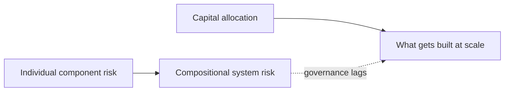

# Chapter 17: Risk and money

Every field that starts moving fast eventually has to answer two questions that have nothing to do with the science itself: what could go wrong, and who is willing to pay for it to keep going. ISMB 2026 asked both, on the same Tuesday and Thursday, in two very different rooms. One was a talk on relational biosecurity. The other was a venture capital panel. Together they are the closing chapter of this book, because they are the two forces that will actually decide which of the agentic AI, knowledge graph, and open-benchmarking ideas covered in the rest of this book survive contact with the world outside a conference hall.

## Contents

- [What is risk and money, in this context?](#what-is-risk-and-money-in-this-context)
- [Why does it exist?](#why-does-it-exist)
- [How does it work?](#how-does-it-work)
- [What this means for you](#what-this-means-for-you)
- [Sources](#sources)

## What is risk and money, in this context?

Michelle Holko's talk on Thursday argued that AI-enabled biology's risk no longer lives inside any single component, a model, a dataset, a lab protocol, but in how components connect to each other, and that current biosecurity safeguards are still built around individual known agents and discrete technologies rather than the compositional systems that now exist.

The Tuesday venture partner panel, featuring Kristina E. Kitko, Anthony Philippakis, and John Keilty, is a different kind of session entirely. It carries no paper, no data, and no peer review, and this chapter treats it accordingly: as investor commentary on where capital is flowing in AI-driven biology and what makes a computational biology idea fundable, not as verified research. It belongs in this book anyway, because capital allocation is one of the two forces, alongside risk governance, that determines which methods from earlier chapters get built into products people actually use.

## Why does it exist?

A field can build the best models and the most rigorous benchmarks in the world and still be shaped entirely by two forces external to the science: whether regulators and the field itself judge it safe enough to keep deploying, and whether investors judge it profitable enough to keep funding. Holko's relational biosecurity framework exists because the field's actual risk surface moved faster than its governance did. Discrete-technology safeguards, built for a world of one dangerous pathogen or one dangerous protocol at a time, do not catch a risk that only appears when several individually benign components are chained together. The VC panel exists for the opposite reason: capital does not wait for governance to catch up, it moves toward whatever looks fundable right now, and understanding where it is moving tells you which parts of this book's technical content are likely to get built out at scale in the near term, regardless of which parts are most scientifically interesting.

## How does it work?

### AI accelerates biological discovery, are we ready for the risks?

Holko's core claim, stated directly: risk no longer resides solely within individual components, but in how they are connected. A generative model that designs a novel biological sequence is not, by itself, necessarily dangerous. A similarity-based screening tool that checks new sequences against known dangerous ones is not, by itself, necessarily inadequate. But chain them together and you get a concrete, cited failure mode: a generative model can produce a novel sequence specifically capable of evading similarity-based synthesis screening, because the screening tool was designed to catch resemblance to known threats, and the generative model's entire function is to produce something that does not resemble anything known. Neither component failed at its individual job. The system failed at the connection between them.

Holko's proposed framework treats interactions between components as explicit objects of design and governance, not implicit byproducts of integration that nobody is responsible for. Concretely, that means building system-level sensing and monitoring rather than only component-level checks, preserving context and uncertainty as information passes across workflow interfaces instead of letting each stage treat the previous stage's output as ground truth, and building buffering into the pipeline specifically to limit how far an error can propagate once it occurs. This is not a talk about whether AI in biology is dangerous in the abstract. It is a talk about where the safety work has to move to once individual tools stop being the unit of risk and pipelines become the unit of risk.

### Industry workshop: Venture Partner panel

This session is explicitly unverified: a panel discussion with no associated paper, no data behind its claims beyond what the panelists said in the room, and no peer review. Nothing in this section should be read as validated research. It is reported here as industry commentary only, because it is the only signal in this book's source material about where investment capital is actually pointed in this field right now.

The panel discussion, per the pre-conference framing and consistent with the session's stated scope, covered where capital is flowing in AI-driven biology, what makes a computational biology bet fundable from an investor's perspective, and how early-career scientists can move toward entrepreneurship. Read next to Holko's talk, the pairing is not a coincidence of scheduling. A venture investor's fundability bar and a biosecurity researcher's compositional risk framework are answering different questions about the same underlying systems: one asks whether a pipeline of AI tools chained together can make money, the other asks whether that same pipeline can be trusted not to produce a harm nobody designed for. Both questions are about systems, not components, and neither one is answered by the underlying science being sound.

## What this means for you

The trade-off this chapter closes on is not new to biomedical AI, but ISMB 2026 stated it unusually plainly across two sessions on two different days. A method can be scientifically excellent and still get built into a product before anyone has done the compositional risk analysis Holko's framework calls for, because capital moves faster than governance. The corrective is not to slow every promising method down until every possible interaction has been mapped, that would stall the field entirely. It is to treat interaction-level risk as a first-class design requirement alongside fundability, not an afterthought bolted on after a product ships. If you are evaluating or building an agentic pipeline anywhere in biomedical AI, the two questions from this chapter are worth asking together, not separately: what does this pipeline do that no individual component in it does alone, and who is paying to make sure that gets built quickly.

This closes the book's arc. Part 1 established agentic AI as the field's working core, systems that reason over evidence and act on it. Part 2 built the knowledge graph infrastructure those systems reason over. Part 3 showed graphs as prediction engines in their own right, turning relational structure into biological forecasts. Part 4 argued that none of it is trustworthy without open, verifiable science backing it. This part pulled the camera back one more level: three keynotes showed that even a technically excellent model or method is only as good as the population and history it was built on, six methods and infrastructure talks showed the stack of representations and benchmarks that make a prediction credible, and this closing chapter names the two forces, risk and money, that decide which of those ideas actually reach the people they are meant to help. The field's trajectory, across all five parts, points the same direction: toward systems that connect more components, reason over more evidence, and reach more of the population that biomedical AI has historically underserved. Whether that trajectory lands well depends on whether the governance and investment layers covered in this final chapter keep pace with everything built in the four before it.

## Sources

| Session | Time | Paper status |
|---------|------|---------------|
| AI accelerates biological discovery, are we ready for the risks? (Michelle Holko) | 15:20-15:40, Thursday | Paper verified |
| Industry workshop: Venture Partner panel (Kristina E. Kitko, Anthony Philippakis, John Keilty) | 15:20-15:50, Tuesday | No paper (panel, unverified) |
